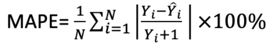

# 环境

* 语言：Python 3.6.1
* 操作系统：windows
* 模块：statsmodels 0.12.1 tqdm 4.50.2 pandas 1.0.5 numpy 1.19.5 scikit-learn 0.23.2 lightgbm 2.3.1

# 赛题

近年来，以A（artificial intelligence）B（big data）C（cloud）为代表的数据智能技术飞速发展。为适应新时期银行科技转型的发展战略，招商银行提出“轻运营”理念，通过对未来业务量进行精准预测，可以合理安排人力，提升关键工作节点的精确化和自动化能力，向着以卓越、高效、低成本为特点的精益运营更进一步。  
本次竞赛给出的数据包含日期、节假日信息、时间段、岗位（含2种岗位A、B）、业务类型和业务量数据。赛题共有两个子任务，任务一的权重为0.7， 任务二的权重为0.3。因此优化任务一收益更高，我们需尽量提升任务一的分值。  

* 任务一：预测未来31天各岗位每天的业务量总量
* 任务二：预测未来31天各岗位每天每半小时粒度的业务总量  

竞赛的评价标准为mape，该指标真实值较小的数据的影响要远大于值较大的。  

# 代码思路

* 任务一：
	* 采用lgb模型对时序数据进行回归建模，特征包括节假日信息，当天的日期信息，包含年月日季度等等信息， 对于AB两类不同的岗位分别训练建模，均使用2020年11月以前的全部数据进行训练，使用2020年11月的数据作为验证集；
	* 使用SARIMAX对数据进行拟合，在数据清洗较完全的情况下，使用acf，pacf可以对模型参数有大概的估计，并且可以通过预测趋势与往年趋势之间的DTW距离作为参数搜索，之后根据趋势确定误差界限。（DTW距离：Dynamic Time Warping，用于衡量两个长度不同的时间序列的相似度的方法，在本题中时间序列长度相同。）
* 任务二：首先对每天的业务模式进行聚类，每天的簇id作为lgb分类预测的label，训练特征为lgb模型的特征加上任务一得到的amount，可适当进行多次取平均。

# 复现过程

* 对于任务一，直接运行day_lgb.ipynb或day_lgb.ipynb可以得到提交文件
* 对于任务二，直接运行kmeans_lgb.ipynb可以生成提交文件