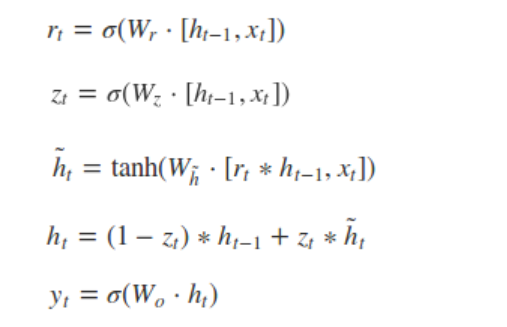

# DIEN理解以及代码解读

## 出发点

DIEN引入用户行为序列信息的原因在于：之前的大部分ctr预估模型，都是将用户的兴趣表达作为模型的输入，缺乏对这些显性行为背后的隐含行为的建模。用户的历史行为都是一个随时间排序的序列，这样的时间序列信息对推荐也是有用的。比如，对于一个电商而言，用户的兴趣迁移是很快的，序列信息的重要性在于：1）加强用户最近行为对于下一次行为预测的影响；2）在电商领域，能够学习到购买的趋势，序列模型能够在一定程度上建立变化兴趣之间的迁移概率，如果两个兴趣的迁移概率在全局统计上够高，那么就可以作为相关推荐。如果放弃序列信息，模型学习时间和趋势的能力就不强，推荐模型仍然基于用户的历史行为推荐。因此需要挖掘行为背后的用户真实兴趣，并考虑用户兴趣的动态变化。

## 模型结构

先上整体框架

- base-model ： 模型的输入是各个维度特征的`embedding`，用户行为建模主要包括两个部分，一部分是黄色部分的特征抽取层，另一部分是红色部分的特征进化层；后面和din相似，将所有特征concat在一起，进行全连接预测，损失是交叉损失函数
- 特征抽取层：主要通过用户的历史行为，学习用户的兴趣迁移，通过兴趣迁移抽取用户兴趣表达

## 特征抽取层

在对用户行为序列进行学习时，选择GRU为基本结构，这样避免了RNN的梯度消失和LSTM参数复杂问题。

但是GRU只能学习行为之间的依赖，并不能很好的反应用户的兴趣；由于最终的兴趣导致了用户行为， Ltarget 也只包含了最终兴趣的监督信息。但由于历史行为的每一个兴趣都会直接导致连续相关行为，因此，作者引入了辅助损失，利用t时刻的行为 Bt+1 作为监督去学习隐含层向量 ht ,除了利用真实的下一个行为作为正样本，负样本就是随机从行为序列中抽取的。

辅助loss的好处在于：1）帮助GRU的隐状态 更好的表达用户兴趣；2）对于GRU而言，对于长序列，在进行梯度反向传播的情况下并不能很好的作用到头部行为，如果在每一个部分引入一个辅助损失，可降低优化难度；3）辅助loss可以给embedding层的学习带来更多语义信息，学习到item对应的更好的embedding；4）类似引入多目标，增加辅助函数只增加了线下训练的成本，但并没增加线上serving时间。

## 兴趣进化层

随着外部环境和内部认知的变化，用户兴趣也不断变化。用户对不同商品的点击行为受不同兴趣的影响，以用户对衣服的爱好作为例子，随着流行度和用户品味的变换，这个进化过程会直接影响ctr的预估效果，兴趣进化层的优势在于：1) 可以是的最终的final interest包含更多的历史行为信息；2) 也可以更好的预估最终的对目标ad的点击。

兴趣进化时，有两个特征：1）多样性，兴趣漂移；2）独立性

> As the diversity of interests, interest can drift. The effect of interest drifting on behaviors is that user may interest in kinds of books during a period of time, and need clothes in another time.
>
> • Though interests may affect each other, each interest has its own evolving process, e.g. the evolving process of books and clothes is almost individually. We only concerns the evolving process that is relative to target item.

在第一阶段引入辅助损失的情况下，可以得到用户历史行为兴趣序列的表达，在兴趣进化层，利用local activate 注意力模型和序列学习 GRU来构建。通过使用兴趣状态和target item计算得到的相关性，AUGRU增强相关兴趣的影响，同时减弱不相关兴趣的影响。

在attention阶段，使用的计算方式为：其中 Ea 为category ad的embedding表示。

另外，兴趣进化层完成注意力机制是通过AUGRU（基于注意力更新门的GRU结构），在原来更新门的结构上加入了注意力得分。

## 代码解读
借鉴的是deepctr_torch模块的代码实现

### 兴趣抽取层

'''

	class InterestExtractor(nn.Module):
	    def __init__(self, input_size, use_neg=False, init_std=0.001, device='cpu'):
	        super(InterestExtractor, self).__init__()
	        self.use_neg = use_neg
	        self.gru = nn.GRU(input_size=input_size, hidden_size=input_size, batch_first=True)
	        if self.use_neg:
	            self.auxiliary_net = DNN(input_size * 2, [100, 50, 1], 'sigmoid', init_std=init_std, device=device)
	        for name, tensor in self.gru.named_parameters():
	            if 'weight' in name:
	                nn.init.normal_(tensor, mean=0, std=init_std)
	        self.to(device)
		
	    def forward(self, keys, keys_length, neg_keys=None):
	        """
	        Parameters
	        ----------
	        keys: 3D tensor, [B, T, H]
	        keys_length: 1D tensor, [B]
	        neg_keys: 3D tensor, [B, T, H]
	
	        Returns
	        -------
	        masked_interests: 2D tensor, [b, H]
	        aux_loss: [1]
	        """
	        batch_size, max_length, dim = keys.size()
	        zero_outputs = torch.zeros(batch_size, dim, device=keys.device)
	        aux_loss = torch.zeros((1,), device=keys.device)
	
	        # create zero mask for keys_length, to make sure 'pack_padded_sequence' safe
	        mask = keys_length > 0
	        masked_keys_length = keys_length[mask]
	
	        # batch_size validation check
	        if masked_keys_length.shape[0] == 0:
	            return zero_outputs,
			# 去除长度未来的输入序列
	        masked_keys = torch.masked_select(keys, mask.view(-1, 1, 1)).view(-1, max_length, dim)
			# 按长度进行截取并进行pack
	        packed_keys = pack_padded_sequence(masked_keys, lengths=masked_keys_length, batch_first=True,
	                                           enforce_sorted=False)
			# 获取兴趣隐状态
	        packed_interests, _ = self.gru(packed_keys)
	        interests, _ = pad_packed_sequence(packed_interests, batch_first=True, padding_value=0.0,
	                                           total_length=max_length)
			
	        if self.use_neg and neg_keys is not None:
				# 使用bt+1去监督兴趣隐状态ht的学习，并且也可以使用负样本来监督
				# 因此最后一个隐状态不要，同理，第一个click行为舍弃
				# 对负样本做相同操作
				# 由于对于click 与兴趣的长度各减一 故所有的序列长度减一
	            masked_neg_keys = torch.masked_select(neg_keys, mask.view(-1, 1, 1)).view(-1, max_length, dim)
	            aux_loss = self._cal_auxiliary_loss(
	                interests[:, :-1, :],
	                masked_keys[:, 1:, :],
	                masked_neg_keys[:, 1:, :],
	                masked_keys_length - 1)
	
	        return interests, aux_loss

	    def _cal_auxiliary_loss(self, states, click_seq, noclick_seq, keys_length):
	        # keys_length >= 1
	        mask_shape = keys_length > 0
	        keys_length = keys_length[mask_shape]
	        if keys_length.shape[0] == 0:
	            return torch.zeros((1,), device=states.device)
			
	        _, max_seq_length, embedding_size = states.size()
			# 筛掉长度为零的序列
	        states = torch.masked_select(states, mask_shape.view(-1, 1, 1)).view(-1, max_seq_length, embedding_size)
	        click_seq = torch.masked_select(click_seq, mask_shape.view(-1, 1, 1)).view(-1, max_seq_length, embedding_size)
	        noclick_seq = torch.masked_select(noclick_seq, mask_shape.view(-1, 1, 1)).view(-1, max_seq_length,
	                                                                                       embedding_size)
	        batch_size = states.size()[0]
			
			# 无关padding 的mask
	        mask = (torch.arange(max_seq_length, device=states.device).repeat(
	            batch_size, 1) < keys_length.view(-1, 1)).float()
			# 生成auxiliary_net的输入，即当前隐状态与下一个点击item的embedding串联，auxiliary_net是一个三层的dnn
	        click_input = torch.cat([states, click_seq], dim=-1)
	        noclick_input = torch.cat([states, noclick_seq], dim=-1)
	        embedding_size = embedding_size * 2
	
	        click_p = self.auxiliary_net(click_input.view(
	            batch_size * max_seq_length, embedding_size)).view(
	            batch_size, max_seq_length)[mask > 0].view(-1, 1)
	        click_target = torch.ones(
	            click_p.size(), dtype=torch.float, device=click_p.device)
	
	        noclick_p = self.auxiliary_net(noclick_input.view(
	            batch_size * max_seq_length, embedding_size)).view(
	            batch_size, max_seq_length)[mask > 0].view(-1, 1)
	        noclick_target = torch.zeros(
	            noclick_p.size(), dtype=torch.float, device=noclick_p.device)
			# 正样本target全为1 负样本target全为0，计算损失并返回
	        loss = F.binary_cross_entropy(
	            torch.cat([click_p, noclick_p], dim=0),
	            torch.cat([click_target, noclick_target], dim=0))
	
	        return loss

'''

通过gru组件得到用户的兴趣状态，pack_padded_sequence与pad_packed_sequence是作用刚好相反的一个把含padding[B,MAXLEN,DIM]打包，另一个则是解压缩为[B,MAXLEN,DIM]形式的序列

### 兴趣转化层

'''

	class InterestEvolving(nn.Module):
	    __SUPPORTED_GRU_TYPE__ = ['GRU', 'AIGRU', 'AGRU', 'AUGRU']
	
	    def __init__(self,
	                 input_size,
	                 gru_type='GRU',
	                 use_neg=False,
	                 init_std=0.001,
	                 att_hidden_size=(64, 16),
	                 att_activation='sigmoid',
	                 att_weight_normalization=False):
	        super(InterestEvolving, self).__init__()
	        if gru_type not in InterestEvolving.__SUPPORTED_GRU_TYPE__:
	            raise NotImplementedError("gru_type: {gru_type} is not supported")
	        self.gru_type = gru_type
	        self.use_neg = use_neg
			# AttentionSequencePoolingLayer主要用于从兴趣隐状态中活动加权的兴趣表达，其实就是计算注意力得分，加权 在scale化，也支持mask
			# self.interest_evolution 则是演化兴趣提取 
	        if gru_type == 'GRU':
	            self.attention = AttentionSequencePoolingLayer(embedding_dim=input_size,
	                                                           att_hidden_units=att_hidden_size,
	                                                           att_activation=att_activation,
	                                                           weight_normalization=att_weight_normalization,
	                                                           return_score=False)
	            self.interest_evolution = nn.GRU(input_size=input_size, hidden_size=input_size, batch_first=True)
	        elif gru_type == 'AIGRU':
	            self.attention = AttentionSequencePoolingLayer(embedding_dim=input_size,
	                                                           att_hidden_units=att_hidden_size,
	                                                           att_activation=att_activation,
	                                                           weight_normalization=att_weight_normalization,
	                                                           return_score=True)
	            self.interest_evolution = nn.GRU(input_size=input_size, hidden_size=input_size, batch_first=True)
	        elif gru_type == 'AGRU' or gru_type == 'AUGRU':
	            self.attention = AttentionSequencePoolingLayer(embedding_dim=input_size,
	                                                           att_hidden_units=att_hidden_size,
	                                                           att_activation=att_activation,
	                                                           weight_normalization=att_weight_normalization,
	                                                           return_score=True)
	            self.interest_evolution = DynamicGRU(input_size=input_size, hidden_size=input_size,
	                                                 gru_type=gru_type)
	        for name, tensor in self.interest_evolution.named_parameters():
	            if 'weight' in name:
	                nn.init.normal_(tensor, mean=0, std=init_std)
	
	    @staticmethod
	    def _get_last_state(states, keys_length):
	        # states [B, T, H]
	        batch_size, max_seq_length, hidden_size = states.size()
	
	        mask = (torch.arange(max_seq_length, device=keys_length.device).repeat(
	            batch_size, 1) == (keys_length.view(-1, 1) - 1))
	
	        return states[mask]
	
	    def forward(self, query, keys, keys_length, mask=None):
	        """
	        Parameters
	        ----------
	        query: 2D tensor, [B, H]
	        keys: (masked_interests), 3D tensor, [b, T, H]
	        keys_length: 1D tensor, [B]
	
	        Returns
	        -------
	        outputs: 2D tensor, [B, H]
	        """
	        batch_size, dim = query.size()
	        max_length = keys.size()[1]
	
	        # check batch validation
	        zero_outputs = torch.zeros(batch_size, dim, device=query.device)
	        mask = keys_length > 0
	        # [B] -> [b]
	        keys_length = keys_length[mask]
	        if keys_length.shape[0] == 0:
	            return zero_outputs
	
	        # [B, H] -> [b, 1, H]
	        query = torch.masked_select(query, mask.view(-1, 1)).view(-1, dim).unsqueeze(1)
			# 兴趣演化提取
	        if self.gru_type == 'GRU':
	            packed_keys = pack_padded_sequence(keys, lengths=keys_length, batch_first=True, enforce_sorted=False)
	            packed_interests, _ = self.interest_evolution(packed_keys)
	            interests, _ = pad_packed_sequence(packed_interests, batch_first=True, padding_value=0.0,
	                                               total_length=max_length)
	            outputs = self.attention(query, interests, keys_length.unsqueeze(1))  # [b, 1, H]
	            outputs = outputs.squeeze(1)  # [b, H]
	        elif self.gru_type == 'AIGRU':
	            att_scores = self.attention(query, keys, keys_length.unsqueeze(1))  # [b, 1, T]
	            interests = keys * att_scores.transpose(1, 2)  # [b, T, H]
	            packed_interests = pack_padded_sequence(interests, lengths=keys_length, batch_first=True,
	                                                    enforce_sorted=False)
	            _, outputs = self.interest_evolution(packed_interests)
	            outputs = outputs.squeeze(0) # [b, H]
	        elif self.gru_type == 'AGRU' or self.gru_type == 'AUGRU':
	            att_scores = self.attention(query, keys, keys_length.unsqueeze(1)).squeeze(1)  # [b, T]
	            packed_interests = pack_padded_sequence(keys, lengths=keys_length, batch_first=True,
	                                                    enforce_sorted=False)
	            packed_scores = pack_padded_sequence(att_scores, lengths=keys_length, batch_first=True,
	                                                 enforce_sorted=False)
	            outputs = self.interest_evolution(packed_interests, packed_scores)
	            outputs, _ = pad_packed_sequence(outputs, batch_first=True, padding_value=0.0, total_length=max_length)
	            # pick last state
	            outputs = InterestEvolving._get_last_state(outputs, keys_length) # [b, H]
	        # [b, H] -> [B, H]
	        zero_outputs[mask] = outputs
	        return zero_outputs
'''

### 整体结构

'''

	class DIEN(BaseModel):
	    """Instantiates the Deep Interest Evolution Network architecture.
	
	    :param dnn_feature_columns: An iterable containing all the features used by deep part of the model.
	    :param history_feature_list: list,to indicate  sequence sparse field
	    :param gru_type: str,can be GRU AIGRU AUGRU AGRU
	    :param use_negsampling: bool, whether or not use negtive sampling
	    :param alpha: float ,weight of auxiliary_loss
	    :param use_bn: bool. Whether use BatchNormalization before activation or not in deep net
	    :param dnn_hidden_units: list,list of positive integer or empty list, the layer number and units in each layer of DNN
	    :param dnn_activation: Activation function to use in DNN
	    :param att_hidden_units: list,list of positive integer , the layer number and units in each layer of attention net
	    :param att_activation: Activation function to use in attention net
	    :param att_weight_normalization: bool.Whether normalize the attention score of local activation unit.
	    :param l2_reg_dnn: float. L2 regularizer strength applied to DNN
	    :param l2_reg_embedding: float. L2 regularizer strength applied to embedding vector
	    :param dnn_dropout: float in [0,1), the probability we will drop out a given DNN coordinate.
	    :param init_std: float,to use as the initialize std of embedding vector
	    :param seed: integer ,to use as random seed.
	    :param task: str, ``"binary"`` for  binary logloss or  ``"regression"`` for regression loss
	    :param device: str, ``"cpu"`` or ``"cuda:0"``
	    :param gpus: list of int or torch.device for multiple gpus. If None, run on `device`. `gpus[0]` should be the same gpu with `device`.
	    :return: A PyTorch model instance.
	
	    """
	
	    def __init__(self,
	                 dnn_feature_columns, history_feature_list,
	                 gru_type="GRU", use_negsampling=False, alpha=1.0, use_bn=False, dnn_hidden_units=(256, 128),
	                 dnn_activation='relu',
	                 att_hidden_units=(64, 16), att_activation="relu", att_weight_normalization=True,
	                 l2_reg_dnn=0, l2_reg_embedding=1e-6, dnn_dropout=0, init_std=0.0001, seed=1024, task='binary',
	                 device='cpu', gpus=None):
	        super(DIEN, self).__init__([], dnn_feature_columns, l2_reg_linear=0, l2_reg_embedding=l2_reg_embedding,
	                                   init_std=init_std, seed=seed, task=task, device=device, gpus=gpus)
	
	        self.item_features = history_feature_list
	        self.use_negsampling = use_negsampling
	        self.alpha = alpha
	        self._split_columns()
	
	        # structure: embedding layer -> interest extractor layer -> interest evolution layer -> DNN layer -> out
	
	        # embedding layer
	        # inherit -> self.embedding_dict
	        input_size = self._compute_interest_dim()
	        # interest extractor layer
	        self.interest_extractor = InterestExtractor(input_size=input_size, use_neg=use_negsampling, init_std=init_std)
	        # interest evolution layer
	        self.interest_evolution = InterestEvolving(
	            input_size=input_size,
	            gru_type=gru_type,
	            use_neg=use_negsampling,
	            init_std=init_std,
	            att_hidden_size=att_hidden_units,
	            att_activation=att_activation,
	            att_weight_normalization=att_weight_normalization)
	        # DNN layer
	        dnn_input_size = self._compute_dnn_dim() + input_size
	        self.dnn = DNN(dnn_input_size, dnn_hidden_units, dnn_activation, l2_reg_dnn, dnn_dropout, use_bn,
	                       init_std=init_std, seed=seed)
	        self.linear = nn.Linear(dnn_hidden_units[-1], 1, bias=False)
	        # prediction layer
	        # inherit -> self.out
	
	        # init
	        for name, tensor in self.linear.named_parameters():
	            if 'weight' in name:
	                nn.init.normal_(tensor, mean=0, std=init_std)
	
	        self.to(device)
	
	    def forward(self, X):
	        # [B, H] , [B, T, H], [B, T, H] , [B]
	        query_emb, keys_emb, neg_keys_emb, keys_length = self._get_emb(X)
	        # [b, T, H],  [1]  (b<H)
	        masked_interest, aux_loss = self.interest_extractor(keys_emb, keys_length, neg_keys_emb)
	        self.add_auxiliary_loss(aux_loss, self.alpha)
	        # [B, H]
	        hist = self.interest_evolution(query_emb, masked_interest, keys_length)
	        # [B, H2]
	        deep_input_emb = self._get_deep_input_emb(X)
	        deep_input_emb = concat_fun([hist, deep_input_emb])
	        dense_value_list = get_dense_input(X, self.feature_index, self.dense_feature_columns)
	        dnn_input = combined_dnn_input([deep_input_emb], dense_value_list)
	        # [B, 1]
	        output = self.linear(self.dnn(dnn_input))
	        y_pred = self.out(output)
	        return y_pred
'''

直接看forward函数，流程很清晰 兴趣抽取，兴趣演化抽取，后面流程就是传统流程了，当然这个包的训练流程类似于TensorFlow模块，其BaseModel的组成大部分如下：

