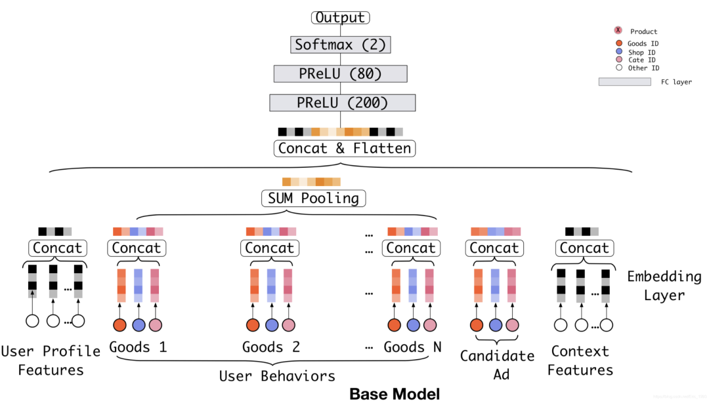
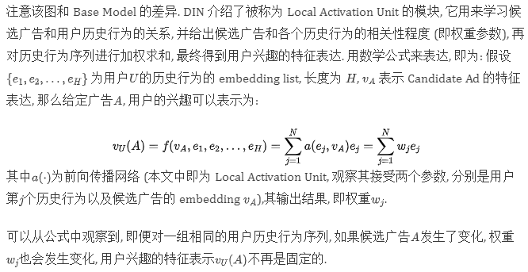
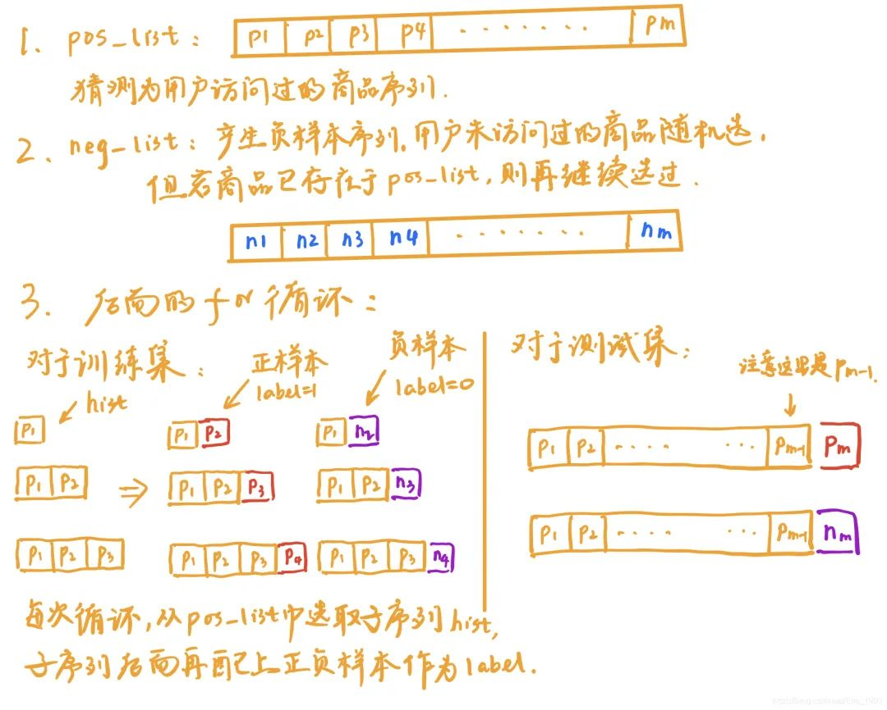
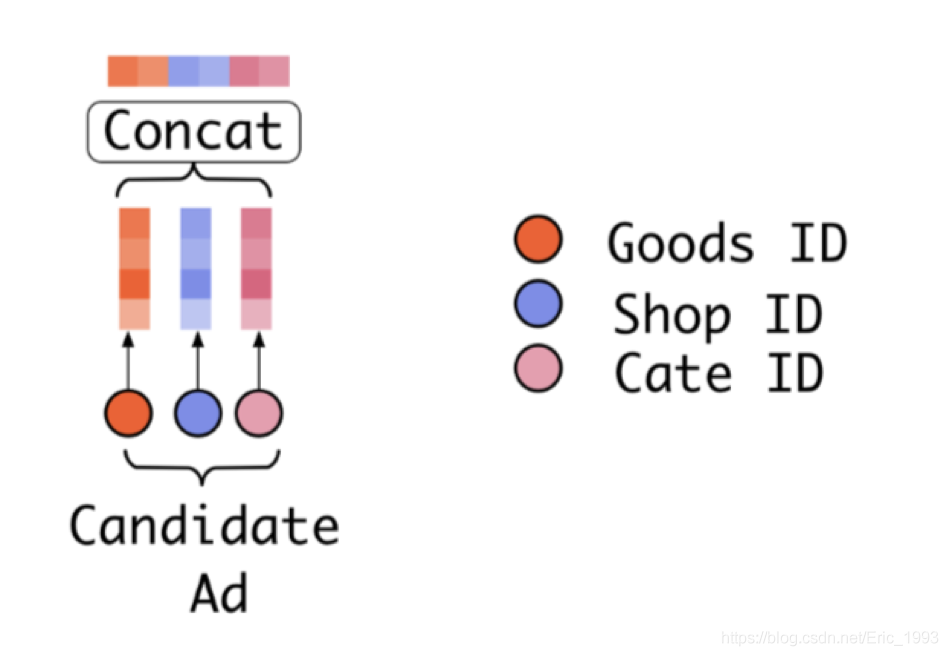
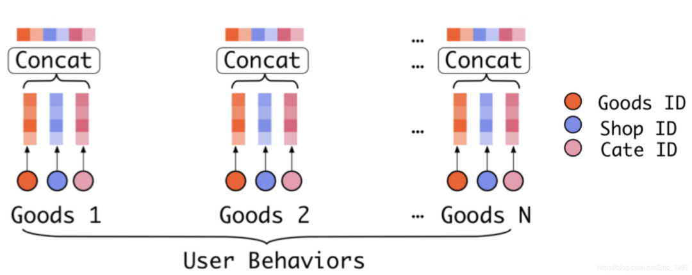
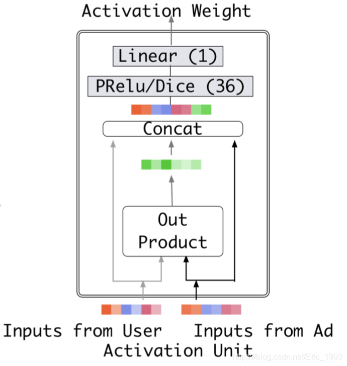
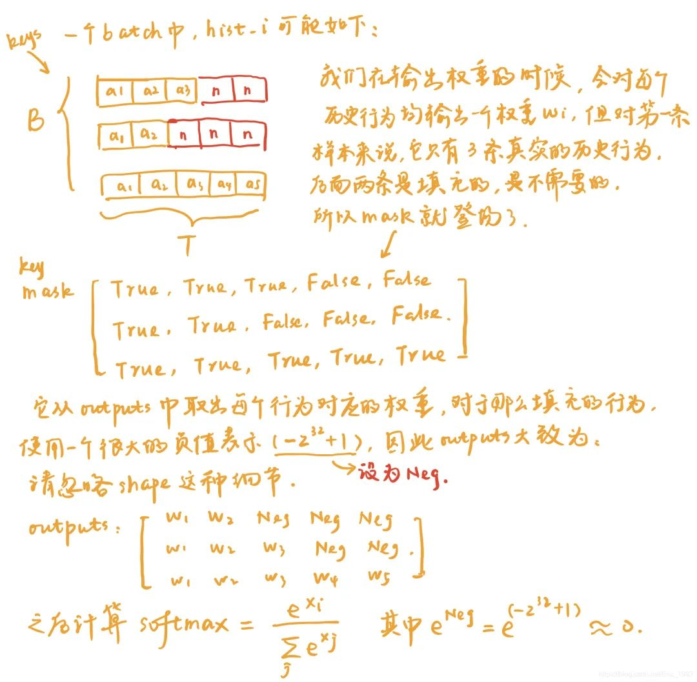
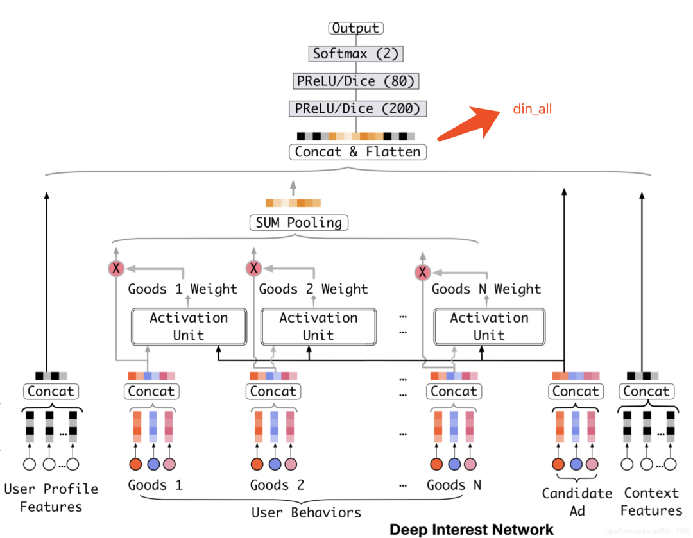

# 深入理解推荐系统：DIN 深度兴趣网络实现
## 核心观点
文章首先介绍了现有的点击率 (CTR) 预估模型大都满足相同的模式: 先将大量的稀疏类别特征 (Categorical Features) 通过 Embedding 技术映射到低维空间, 再将这些特征的低维表达按照特征的类别进行组合与变换 (文中采用 in a group-wise manner 来描述), 以形成固定长度的向量 (比如常用的 sum pooling / mean pooling), 最后将这些向量 concatenate 起来输入到一个 MLP (Multi-Layer Perceptron) 中, 从而学习这些特征间的非线性关系.

然而这个模式存在一个问题. 举个例子, 在电商场景下, 用户兴趣可以使用用户的历史行为来描述 (比如用户访问过的商品, 店铺或者类目), 然而如果按照现有的处理模式, 对于不同的候选广告, 用户的兴趣始终被映射为同一个固定长度的向量来表示, 这极大的限制了模型的表达能力, 毕竟用户的兴趣是多样的.

为了解决这个问题, 本文提出了 DIN 网络, 对于不同的候选广告, 考虑该广告和用户历史行为的相关性, 以便自适应地学习用户兴趣的特征表达. 具体来说, 文章介绍了 local activation unit 模块, 其基于 Attention 机制, 对用户历史行为进行加权来表示用户兴趣, 其中权重参数是通过候选广告和历史行为交互来进行学习的.

另外, 本文还介绍了 Mini-batch Aware Regularization 与 Dice 激活函数两种技术, 以帮助训练大型的网络.

### Base Model

观察下图的 Base Model, 是现有的大多数 CTR 模型采用的模式: 


其中红蓝粉三色节点分别表示商品 ID (Goods ID), 店铺 ID (Shop ID), 类目 ID (Cate ID) 三种稀疏特征, 其他的输入特征, 使用白色节点表示 (比如左边的用户特征, 比如用户 ID; 还有右边的上下文特征, 比如广告位之类的特征). 注意 Goods 1 ~ Goods N 用来描述用户的历史行为. 候选广告 Candidate Ad 本身也是商品, 也具有 Goods / Shop / Cate ID 三种特征. 之后使用 Embedding Layer 将这些类别特征转化为 dense 的低维稠密向量, 其中对于用户历史行为特征, 之后使用 SUM Pooling 转化为一个固定长度的向量, 该向量可以表示用户的兴趣; 这里需要注意上一节 “核心观点” 中提到的问题, 对于同一个用户, 如果候选广告 (Candidate Ad) 发生了变化, 用户的兴趣却依然是同一个向量来表达, 显然这限制了模型的表达能力, 毕竟用户的兴趣是丰富的/变化的。
### DIN网络
为了解决上面的问题, 本文提出了深度兴趣网络 DIN, 如下图: 



## 源码解析
### 数据处理
```

	for reviewerID, hist in reviews_df.groupby('reviewerID'):
	  pos_list = hist['asin'].tolist()
	  def gen_neg():
	    neg = pos_list[0]
	    while neg in pos_list:
	      neg = random.randint(0, item_count-1)
	    return neg
	  neg_list = [gen_neg() for i in range(len(pos_list))]
	
	  for i in range(1, len(pos_list)):
	    hist = pos_list[:i]
	    if i != len(pos_list) - 1:
	      train_set.append((reviewerID, hist, pos_list[i], 1))
	      train_set.append((reviewerID, hist, neg_list[i], 0))
	    else:
	      label = (pos_list[i], neg_list[i])
	      test_set.append((reviewerID, hist, label))
```


### 构建训练集与测试集
上一节对原始数据进行处理, 得到数据:
```

	## 训练数据
	train_set.append((reviewerID, hist, pos_list[i], 1))
	train_set.append((reviewerID, hist, neg_list[i], 0))
	
	## 测试数据
	label = (pos_list[i], neg_list[i])
	test_set.append((reviewerID, hist, label))
```
之后训练集的制作使用 DataInput 实现, 其为一个迭代器:
```

	class DataInput:
	  ## ..... 不核心的代码去掉
	  def next(self):
	
	    if self.i == self.epoch_size:
	      raise StopIteration
	
	    ts = self.data[self.i * self.batch_size : min((self.i+1) * self.batch_size,
	                                                  len(self.data))]
	    self.i += 1
	
	    u, i, y, sl = [], [], [], []
	    for t in ts:
	      ## t 表示 (reviewerID, hist, pos_list[i]/neg_list[i], 1/0)
	      ## 其中 t[1] = hist, 为用户历史行为序列
	      u.append(t[0]) 
	      i.append(t[2])
	      y.append(t[3])
	      sl.append(len(t[1]))
	    max_sl = max(sl)
	
	    hist_i = np.zeros([len(ts), max_sl], np.int64)
	
	    k = 0
	    for t in ts:
	      for l in range(len(t[1])):
	        hist_i[k][l] = t[1][l]
	      k += 1
	
	    return self.i, (u, i, y, hist_i, sl)
```

DataInput 从 train_set 中读取数据, 其中:

- u 保存用户的 User ID, 即代码中 reviewID, 那么u就是用户 ID 序列
- i 表示正样本/负样本, 后面正负样本我统一用目标节点 (target) 来描述, 即 i为目标节点序列
- y 表示目标节点的 label, 取值为 1 或 0;
- sl 保存用户历史行为序列的真实长度 (代码中的 len(t[1]) 就是求历史行为序列的长度), `max_sl`表示序列中的最大长度;
由于用户历史序列的长度是不固定的, 因此引入 `hist_i`, 其为一个矩阵, 将序列长度固定为 maxsl. 对于长度不足 `max_sl` 的序列, 使用 0 来进行填充 (注意 `hist_i` 使用 zero 矩阵来进行初始化的)

测试集的制作基本同理:
```

	class DataInputTest:
	  ## 忽略不核心的代码
	  def next(self):
	
	    if self.i == self.epoch_size:
	      raise StopIteration
	
	    ts = self.data[self.i * self.batch_size : min((self.i+1) * self.batch_size,
	                                                  len(self.data))]
	    self.i += 1
	
	    u, i, j, sl = [], [], [], []
	    for t in ts:
	      ## t 表示: (reviewerID, hist, label)
	      ## 其中 label 为 (pos_list[i], neg_list[i])
	      u.append(t[0])
	      i.append(t[2][0])
	      j.append(t[2][1])
	      sl.append(len(t[1]))
	    max_sl = max(sl)
	
	    hist_i = np.zeros([len(ts), max_sl], np.int64)
	
	    k = 0
	    for t in ts:
	      for l in range(len(t[1])):
	        hist_i[k][l] = t[1][l]
	      k += 1
	
	    return self.i, (u, i, j, hist_i, sl)
```

由于前面 `test_set` 返回的结果: `(reviewerID, hist, label)`, 其中 `label` 表示 `(pos_list[i], neg_list[i])`, 所以:

- u 保存用户的 User ID, 即代码中 `reviewID`, 那么 u 就是用户 ID 序列
- i 保存正样本
- j 保存负样本
- sl 保存用户历史行为序列的真实长度 (代码中的 `len(t[1]`) 就是求历史行为序列的长度),`max_sl` 表示序列中的最大长度;
- `hist_i` 保存用户历史行为序列, 长度不足 `max_sl` 的序列后面用 0 填充.

### 模型构建
```

	class Model(object):
	
	  def __init__(self, user_count, item_count, cate_count, cate_list, predict_batch_size, predict_ads_num):
	
	    self.u = tf.placeholder(tf.int32, [None,]) # [B]
	    self.i = tf.placeholder(tf.int32, [None,]) # [B]
	    self.j = tf.placeholder(tf.int32, [None,]) # [B]  ## 读代码的时候可以先忽略关于 self.j 的部分
	    self.y = tf.placeholder(tf.float32, [None,]) # [B]
	    self.hist_i = tf.placeholder(tf.int32, [None, None]) # [B, T]
	    self.sl = tf.placeholder(tf.int32, [None,]) # [B]
	    self.lr = tf.placeholder(tf.float64, [])
```

先来看如果是训练集, 模型会传入哪些参数:

- `self.u`: 用户 ID 序列
- `self.i`: 目标节点序列 (目标节点就是正或负样本)
- `self.y`: 目标节点对应的 label 序列, 正样本对应 1, 负样本对应 0
- `self.hist_i`: 用户历史行为序列, 大小为 [B, T]
- `self.sl`: 记录用户行为序列的真实长度
- `self.lr`: 学习速率

### Embedding 获取
```

	### 用户 embedding, 整个代码没有被用到 .....
	user_emb_w = tf.get_variable("user_emb_w", [user_count, hidden_units])
	### 目标节点对应的商品 embedding
	item_emb_w = tf.get_variable("item_emb_w", [item_count, hidden_units // 2])
	### 如果我没有猜错, 这应该是 bias
	item_b = tf.get_variable("item_b", [item_count],
	                         initializer=tf.constant_initializer(0.0))
	### 类目 embedding
	cate_emb_w = tf.get_variable("cate_emb_w", [cate_count, hidden_units // 2])
	cate_list = tf.convert_to_tensor(cate_list, dtype=tf.int64)
	
	## 从 cate_list 中获取目标节点对应的类目 id
	ic = tf.gather(cate_list, self.i)
	## 将目标节点对应的商品 embedding 和类目 embedding 进行 concatenation
	i_emb = tf.concat(values = [
	    tf.nn.embedding_lookup(item_emb_w, self.i),
	    tf.nn.embedding_lookup(cate_emb_w, ic),
	    ], axis=1)
	i_b = tf.gather(item_b, self.i)
	
	## 注意 self.hist_i 保存用户的历史行为序列, 大小为 [B, T], 所以在进行 embedding_lookup 时,
	## 输出大小为 [B, T, H/2]; 之后将 Goods 和 Cate 的 embedding 进行 concat, 得到
	## [B, T, H] 大小. 注意到 tf.concat 中的 axis 参数值为 2
	hc = tf.gather(cate_list, self.hist_i)
	h_emb = tf.concat([
	    tf.nn.embedding_lookup(item_emb_w, self.hist_i),
	    tf.nn.embedding_lookup(cate_emb_w, hc),
	    ], axis=2)
```

上面的代码主要是对用户 embedding layer, 商品 embedding layer 以及类目 embedding layer 进行初始化, 然后在获取一个 Batch 中目标节点对应的 embedding, 保存在 `i_emb` 中, 它由商品 (Goods) 和类目 (Cate) embedding 进行 concatenation, 相当于完成了下图中的步骤:

后面对 `self.hist_i` 进行处理, 其保存了用户的历史行为序列, 大小为 `[B, T]`, 所以在进行 embedding_lookup 时, 输出大小为 `[B, T, H/2]`; 之后将 Goods 和 Cate 的 embedding 进行 concat, 得到 `[B, T, H]` 大小. 注意到 `tf.concat` 中的 `axis` 参数值为 2, 相当于完成下图中的步骤:


### Attention
经过上面的处理, 我们已经得到候选广告对应的 `embedding i_emb`, 大小为 `[B, H]`, 以及用户历史行为对应的 `embedding hist_i`, 大小为 `[B, T, H]`, 下面将它们输入 `Attention` 层中, 自适应学习用户兴趣的表征.

```

	### 注意原代码中写的是 hist_i =attention(i_emb, h_emb, self.sl)
	### 为了方便说明, 返回值用 u_emb_i 来表示, 即 Attention 之后返回用户的兴趣表征;
	### 源代码中返回的结果 hist_i 还经过了 BN 层, 当然这不是我们关心的重点
	u_emb_i = attention(i_emb, h_emb, self.sl)
```
其中 Attention 层的具体实现为:
```

	def attention(queries, keys, keys_length):
	  '''
	    queries:     [B, H]
	    keys:        [B, T, H]
	    keys_length: [B], 保存着用户历史行为序列的真实长度
	  '''
	  ## queries.get_shape().as_list()[-1] 就是 H,
	  ## tf.shape(keys)[1] 结果就是 T
	  queries_hidden_units = queries.get_shape().as_list()[-1]
	  queries = tf.tile(queries, [1, tf.shape(keys)[1]]) ## [B, T * H], 想象成贴瓷砖
	  ## queries 先 reshape 成和 keys 相同的大小: [B, T, H]
	  queries = tf.reshape(queries, [-1, tf.shape(keys)[1], queries_hidden_units])
	  
	  ## Local Activation Unit 的输入, 候选广告 queries 对应的 emb 以及用户历史行为序列 keys
	  ## 对应的 embed, 再加上它们之间的交叉特征, 进行 concat 后, 再输入到一个 DNN 网络中
	  ## DNN 网络的输出节点为 1
	  din_all = tf.concat([queries, keys, queries-keys, queries*keys], axis=-1)
	  d_layer_1_all = tf.layers.dense(din_all, 80, activation=tf.nn.sigmoid, name='f1_att', reuse=tf.AUTO_REUSE)
	  d_layer_2_all = tf.layers.dense(d_layer_1_all, 40, activation=tf.nn.sigmoid, name='f2_att', reuse=tf.AUTO_REUSE)
	  d_layer_3_all = tf.layers.dense(d_layer_2_all, 1, activation=None, name='f3_att', reuse=tf.AUTO_REUSE)
	  ## 上一层 d_layer_3_all 的 shape 为 [B, T, 1]
	  ## 下一步 reshape 为 [B, 1, T], axis=2 这一维表示 T 个用户行为序列分别对应的权重参数
	  d_layer_3_all = tf.reshape(d_layer_3_all, [-1, 1, tf.shape(keys)[1]])
	  outputs = d_layer_3_all  ## [B, 1, T]
	  
	  # Mask
	  ## 由于一个 Batch 中的用户行为序列不一定都相同, 其真实长度保存在 keys_length 中
	  ## 所以这里要产生 masks 来选择真正的历史行为
	  key_masks = tf.sequence_mask(keys_length, tf.shape(keys)[1])   # [B, T]
	  key_masks = tf.expand_dims(key_masks, 1) # [B, 1, T]
	  paddings = tf.ones_like(outputs) * (-2 ** 32 + 1)
	  ## 选出真实的历史行为, 而对于那些填充的结果, 适用 paddings 中的值来表示
	  ## padddings 中使用巨大的负值, 后面计算 softmax 时, e^{x} 结果就约等于 0
	  outputs = tf.where(key_masks, outputs, paddings)  # [B, 1, T]
	
	  # Scale
	  outputs = outputs / (keys.get_shape().as_list()[-1] ** 0.5)
	
	  # Activation
	  outputs = tf.nn.softmax(outputs)  # [B, 1, T]
	
	  # Weighted sum
	  ## outputs 的大小为 [B, 1, T], 表示每条历史行为的权重,
	  ## keys 为历史行为序列, 大小为 [B, T, H];
	  ## 两者用矩阵乘法做, 得到的结果就是 [B, 1, H]
	  outputs = tf.matmul(outputs, keys)  # [B, 1, H]
	
	  return outputs
```

代码中给了详细的注释. 其中, Local Attention Unit 的输入除了候选广告的 embedding 以及用户历史行为的 embedding, 还有它们之间的交叉特征:

```
	
	## queries 传入候选广告的 embedding, keys 传入用户历史行为的 embedding
	## queries-keys, queries*keys 均为交叉特征
	din_all = tf.concat([queries, keys, queries-keys, queries*keys], axis=-1)
	
	outputs = DNN(din_all)  ## 简略代码, 用来说明问题
```

之后 `din_all` 会输入到 DNN, 以产生权重, 相当于完成下面的步骤:

之后进行的重要一步是 产生 Mask, 这是因为:

得到正确的权重 outputs 以及用户历史行为序列 keys, 再进行矩阵相乘得到用户的兴趣表征:
```

	# Weighted sum
	## outputs 的大小为 [B, 1, T], 表示每条历史行为的权重,
	## keys 为历史行为序列, 大小为 [B, T, H];
	## 两者用矩阵乘法做, 得到的结果就是 [B, 1, H]
	outputs = tf.matmul(outputs, keys)  # [B, 1, H]
```

### 全连接层


这个没啥好说的, `din_i` 中:

- `u_emb_i`: 由 Attention 层得到的输出结果, 表示用户兴趣;
- `i_emb`: 候选广告对应的 embedding;
- `u_emb_i` * `i_emb`: 用户兴趣和候选广告的交叉特征;

```

	din_i = tf.concat([u_emb_i, i_emb, u_emb_i * i_emb], axis=-1)
	din_i = tf.layers.batch_normalization(inputs=din_i, name='b1')
	d_layer_1_i = tf.layers.dense(din_i, 80, activation=tf.nn.sigmoid, name='f1')
	#if u want try dice change sigmoid to None and add dice layer like following two lines. You can also find model_dice.py in this folder.
	# d_layer_1_i = tf.layers.dense(din_i, 80, activation=None, name='f1')
	# d_layer_1_i = dice(d_layer_1_i, name='dice_1_i')
	d_layer_2_i = tf.layers.dense(d_layer_1_i, 40, activation=tf.nn.sigmoid, name='f2')
	# d_layer_2_i = tf.layers.dense(d_layer_1_i, 40, activation=None, name='f2')
	# d_layer_2_i = dice(d_layer_2_i, name='dice_2_i')
	d_layer_3_i = tf.layers.dense(d_layer_2_i, 1, activation=None, name='f3')
```
