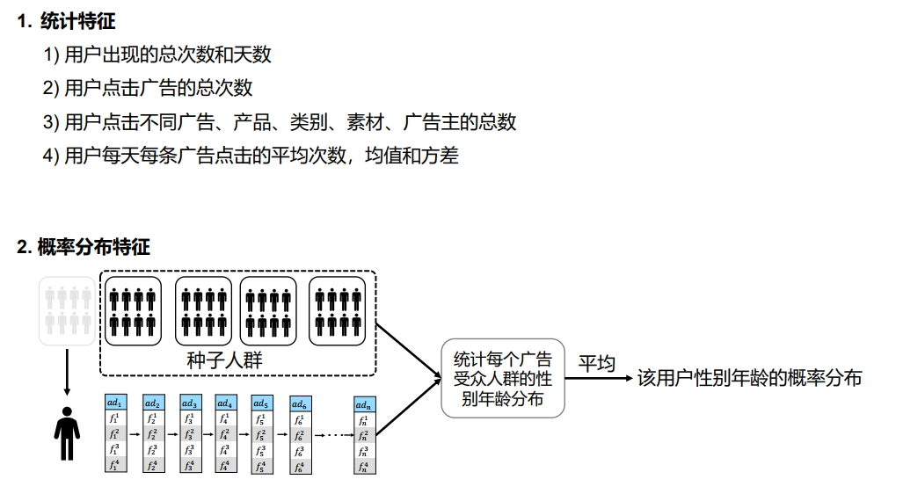
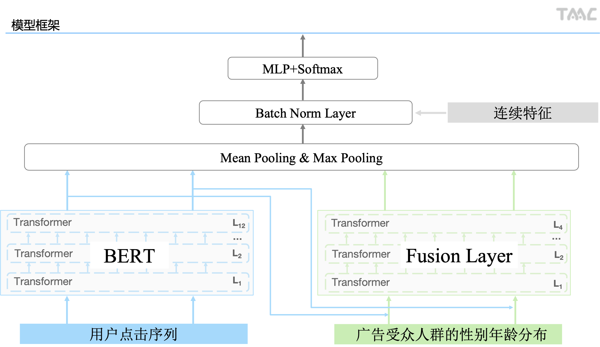
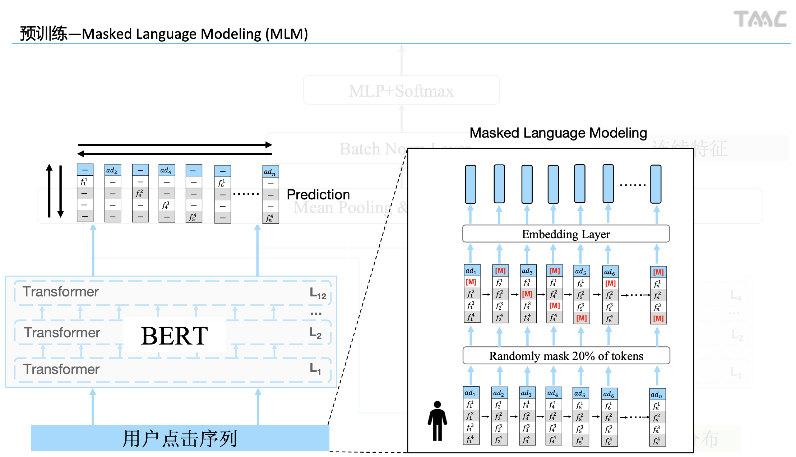
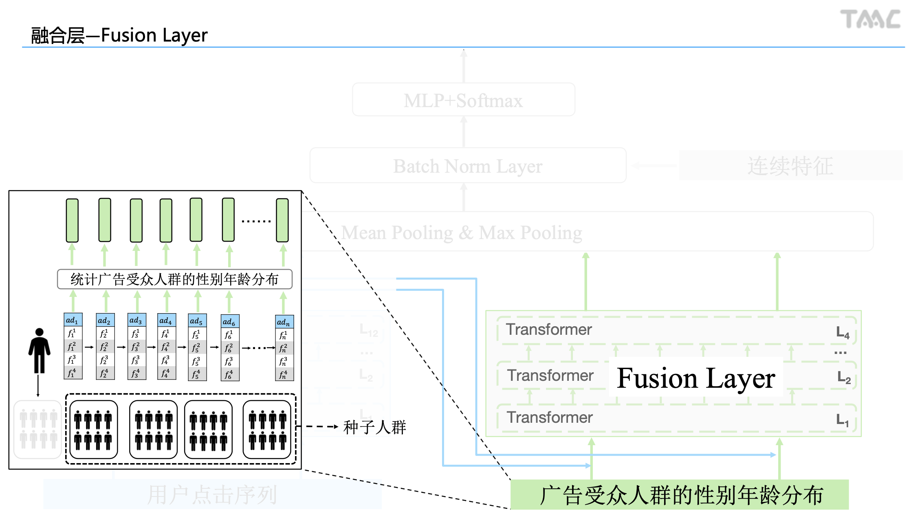
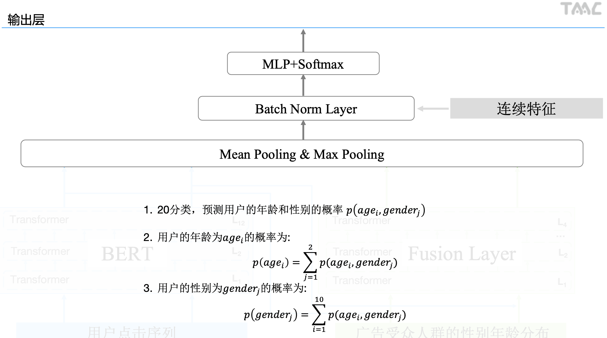

## 一、特征工程

### 1.1 获取聚合特征
```

    print("Extracting aggregate feature...")
    agg_features = []
    agg_features += get_agg_features([train_df, test_df], 'user_id', '', 'size', click_log)
    agg_features += get_agg_features([train_df, test_df], 'user_id', 'ad_id', 'unique', click_log)
    agg_features += get_agg_features([train_df, test_df], 'user_id', 'creative_id', 'unique', click_log)
    agg_features += get_agg_features([train_df, test_df], 'user_id', 'advertiser_id', 'unique', click_log)
    agg_features += get_agg_features([train_df, test_df], 'user_id', 'industry', 'unique', click_log)
    agg_features += get_agg_features([train_df, test_df], 'user_id', 'product_id', 'unique', click_log)
    agg_features += get_agg_features([train_df, test_df], 'user_id', 'time', 'unique', click_log)
    agg_features += get_agg_features([train_df, test_df], 'user_id', 'click_times', 'sum', click_log)
    agg_features += get_agg_features([train_df, test_df], 'user_id', 'click_times', 'mean', click_log)
    agg_features += get_agg_features([train_df, test_df], 'user_id', 'click_times', 'std', click_log)
    train_df[agg_features] = train_df[agg_features].fillna(-1)
    test_df[agg_features] = test_df[agg_features].fillna(-1)
    print("Extracting aggregate feature done!")
    print("List aggregate feature names:")
    print(agg_features)
```
### 1.2 获取序列特征，用户点击的id序列
用户点击广告的id序列，包含广告id等8个特征，每个特征会使用128维embedding进行表征
```

    print("Extracting sequence feature...")
    text_features = []
    text_features += sequence_text([train_df, test_df], 'user_id', 'ad_id', click_log)
    text_features += sequence_text([train_df, test_df], 'user_id', 'creative_id', click_log)
    text_features += sequence_text([train_df, test_df], 'user_id', 'advertiser_id', click_log)
    text_features += sequence_text([train_df, test_df], 'user_id', 'product_id', click_log)
    text_features += sequence_text([train_df, test_df], 'user_id', 'industry', click_log)
    text_features += sequence_text([train_df, test_df], 'user_id', 'product_category', click_log)
    text_features += sequence_text([train_df, test_df], 'user_id', 'time', click_log)
    text_features += sequence_text([train_df, test_df], 'user_id', 'click_times', click_log)
    print("Extracting sequence feature done!")
    print("List sequence feature names:")
    print(text_features)
```
### 1.3 求出用户点击的所有记录的年龄性别平均分布
```

    # 获取K折统计特征，求出用户点击的所有记录的年龄性别平均分布
    # 赋值index,训练集为0-4，测试集为5
    print("Extracting Kflod feature...")
    log = click_log.drop_duplicates(['user_id', 'creative_id']).reset_index(drop=True)
    del click_log
    gc.collect()
    log['cont'] = 1
    train_df['fold'] = train_df.index % 5
    test_df['fold'] = 5
    df = train_df.append(test_df)[['user_id', 'fold']].reset_index(drop=True)
    log = log.merge(df, on='user_id', how='left')
    del df
    gc.collect()
    # 获取用户点击某特征的年龄性别平均分布
    for pivot in ['creative_id', 'ad_id', 'product_id', 'advertiser_id', 'industry']:
        print("Kfold", pivot)
        kfold(train_df, test_df, log, pivot)
    del log
    gc.collect()
    print("Extracting Kflod feature done!")
```
### 1.4 序列特征，用户点击记录的年龄性别分布
```

    # 获取K折序列特征,求出用户点击的每一条记录的年龄性别分布
    # 赋值index,训练集为0-4，测试集为5
    print("Extracting Kflod sequence feature...")
    click_log = pd.read_pickle('data/click.pkl')
    log = click_log.reset_index(drop=True)
    del click_log
    gc.collect()
    log['cont'] = 1
    train_df['fold'] = train_df.index % 5
    train_df['fold'] = train_df['fold'].astype(int)
    test_df['fold'] = 5
    df = train_df.append(test_df)[['user_id', 'fold']].reset_index(drop=True)
    log = log.merge(df, on='user_id', how='left')
    # 获取用户点击某特征的年龄性别分布序列
    kfold_sequence_features = []
    for pivot in ['creative_id', 'ad_id', 'product_id', 'advertiser_id', 'industry']:
        print("Kfold sequence", pivot)
        kfold_sequence_features += kfold_sequence(train_df, test_df, log, pivot)
    del log
    gc.collect()
    print("Extracting Kfold sequence feature done!")
    print("List Kfold sequence feature names:")
    print(kfold_sequence_features)
```
## 二、模型框架


预训练层结合fusion层作为特征提取器,去第一个输出序列的max pooling与mean pooling作为特征，结合用户的统计特征输入作为MLP的输入，最后输出各个年龄段的概率分布（20分类，年龄10*性别2）
MLM层使用预训练好的bert模型与embedding（通过w2v模型获得）
Fusion层则随机初始化参数
```

    def __init__(self, args):
        super(Model, self).__init__()
        args.out_size = len(args.dense_features)
        self.dropout = nn.Dropout(args.hidden_dropout_prob)
        self.args = args

        # 创建BERT模型，并且导入预训练模型
        config = RobertaConfig.from_pretrained(args.pretrained_model_path)
        config.output_hidden_states = True
        args.hidden_size = config.hidden_size
        args.num_hidden_layers = config.num_hidden_layers
        self.text_layer = RobertaModel.from_pretrained(args.pretrained_model_path, config=config)
        self.text_linear = nn.Linear(args.text_dim + args.vocab_dim_v1 * len(args.text_features), args.hidden_size)
        logger.info("Load linear from %s", os.path.join(args.pretrained_model_path, "linear.bin"))
        self.text_linear.load_state_dict(torch.load(os.path.join(args.pretrained_model_path, "linear.bin")))
        logger.info("Load embeddings from %s", os.path.join(args.pretrained_model_path, "embeddings.bin"))
        self.text_embeddings = nn.Embedding.from_pretrained(
            torch.load(os.path.join(args.pretrained_model_path, "embeddings.bin"))['weight'], freeze=True)
        args.out_size += args.hidden_size * 2

        # 创建fusion-layer模型，随机初始化
        config = RobertaConfig()
        config.num_hidden_layers = 4
        config.intermediate_size = 2048
        config.hidden_size = 512
        config.num_attention_heads = 16
        config.vocab_size = 5
        self.text_layer_1 = RobertaModel(config=config)
        self.text_layer_1.apply(self._init_weights)
        self.text_linear_1 = nn.Linear(args.text_dim_1 + args.hidden_size, 512)
        self.text_linear_1.apply(self._init_weights)
        self.norm = nn.BatchNorm1d(args.text_dim_1 + args.hidden_size)
        args.out_size += 1024

        # 创建分类器，随机初始化
        self.classifier = ClassificationHead(args)
        self.classifier.apply(self._init_weights)
```

## 三、预训练模型

使用roberta作为基础模型，`embedding size`为1024
```

	class Model(nn.Module):   
	    def __init__(self, encoder,config,args):
	        super(Model, self).__init__()
	        self.encoder = encoder
	        self.lm_head=[]
	        self.text_embeddings=nn.Embedding(args.vocab_size_v1,args.vocab_dim_v1)
	        self.text_embeddings.apply(self._init_weights)
	        self.text_linear=nn.Linear(args.text_dim+args.vocab_dim_v1*len(args.text_features), config.hidden_size)
	        self.text_linear.apply(self._init_weights)
	        for x in args.vocab_size:
	            self.lm_head.append(nn.Linear(config.hidden_size, x, bias=False))
	        self.lm_head=nn.ModuleList(self.lm_head)
	        self.config=config
	        self.args=args
	        
	    def _init_weights(self, module):
	        """ Initialize the weights """
	        if isinstance(module, (nn.Linear, nn.Embedding)):
	            # Slightly different from the TF version which uses truncated_normal for initialization
	            # cf https://github.com/pytorch/pytorch/pull/5617
	            module.weight.data.normal_(mean=0.0, std=0.02)
	            
	    def forward(self, inputs,inputs_ids,masks,labels):     
	        inputs_embedding=self.text_embeddings(inputs_ids).view(inputs.size(0),inputs.size(1),-1)
	        inputs=torch.cat((inputs.float(),inputs_embedding),-1)
	        inputs=torch.relu(self.text_linear(inputs))
	        outputs = self.encoder(inputs_embeds=inputs,attention_mask=masks.float())[0]
	        loss=0
	        for idx,(x,y) in enumerate(zip(self.lm_head,self.args.text_features)):
	            if y[3] is True:
	                outputs_tmp=outputs[labels[:,:,idx].ne(-100)]
	                labels_tmp=labels[:,:,idx]
	                labels_tmp=labels_tmp[labels_tmp.ne(-100)].long()
	                prediction_scores = x(outputs_tmp)
	                loss_fct = CrossEntropyLoss()
	                masked_lm_loss = loss_fct(prediction_scores, labels_tmp)
	                loss=loss+masked_lm_loss
	        return loss
```

一个广告点击序列有8个特征，每个特征都通过各自域的id表示，其各种的embedding通过w2v模型训练得到,text_ids为预训练中的输入ids，text_masks表示是否为padding mask，text_label记录mask的位置，需要注意的是输入序列为blocksize*numoffeatures,所以在mask操作的同时需要对相对应位置的textfeaturesembedding进行mask。作者对每个域的id进行了截取，每个域最多保留10w个id。

```

	class TextDataset(Dataset):
	    def __init__(self, args, df, embedding_table):
	        self.text_features = [df[x[1]].values for x in args.text_features]
	        self.embedding_table = embedding_table
	        self.args = args
	        self.vocab = [list(x) for x in args.vocab]
	
	    def __len__(self):
	        return len(self.text_features[0])
	
	    def __getitem__(self, i):
	        text_features = np.zeros((self.args.block_size, self.args.text_dim))
	        text_ids = np.zeros((self.args.block_size, len(self.args.text_features)), dtype=np.int64)
	        text_masks = np.zeros(self.args.block_size)
	        text_label = np.zeros((self.args.block_size, len(self.args.text_features)), dtype=np.int64) - 100
	        begin_dim = 0
	        # 选择20%的token进行掩码，其中80%设为[mask], 10%设为[UNK],10%随机选择
	        for idx, x in enumerate(self.args.text_features):
	            end_dim = begin_dim + x[2]
	            for word_idx, word in enumerate(self.text_features[idx][i].split()[:self.args.block_size]):
	                text_masks[word_idx] = 1
	                if random.random() < self.args.mlm_probability:
	                    if word in self.args.vocab[idx]:
	                        text_label[word_idx, idx] = self.args.vocab[idx][word]
	                    else:
	                        text_label[word_idx, idx] = 0
	                    if random.random() < 0.8:
	                        text_ids[word_idx, idx] = self.args.vocab_dic['mask']
	                    elif random.random() < 0.5:
	                        text_features[word_idx, begin_dim:end_dim] = self.embedding_table[idx][word]
	                        try:
	                            text_ids[word_idx, idx] = self.args.vocab_dic[(x[1], word)]
	                        except:
	                            text_ids[word_idx, idx] = self.args.vocab_dic['unk']
	                    else:
	                        while True:
	                            random_word = random.sample(self.vocab[idx], 1)[0]
	                            if random_word != word:
	                                break
	                        text_features[word_idx, begin_dim:end_dim] = self.embedding_table[idx][random_word]
	                        try:
	                            text_ids[word_idx, idx] = self.args.vocab_dic[(x[1], random_word)]
	                        except:
	                            text_ids[word_idx, idx] = self.args.vocab_dic['unk']
	                else:
	                    try:
	                        text_ids[word_idx, idx] = self.args.vocab_dic[(x[1], word)]
	                    except:
	                        text_ids[word_idx, idx] = self.args.vocab_dic['unk']
	                    text_features[word_idx, begin_dim:end_dim] = self.embedding_table[idx][word]
	            begin_dim = end_dim
	        return torch.tensor(text_features), torch.tensor(text_ids), torch.tensor(text_masks), torch.tensor(text_label)
```

## Fusion模型

文中，作者在fusion层不仅使用了用户浏览广告序列的广告受众人群的性别年龄分布，还融合MLM层输出的Hide status，fusion新版年龄分布共60维，hide status为1024维，通过线性变换为512维，故transformer encoder层的输入维数为512层
```

    def forward(self, dense_features, text_features, text_ids, text_masks, text_features_1, text_masks_1, labels=None):
        outputs = []
        # 获取浮点数，作为分类器的输入
        outputs.append(dense_features.float())
        # 获取BERT模型的hidden state，并且做max pooling和mean pooling作为分类器的输入
        text_masks = text_masks.float()
        text_embedding = self.text_embeddings(text_ids).view(text_ids.size(0), text_ids.size(1), -1)
        text_features = torch.cat((text_features.float(), text_embedding), -1)
        text_features = torch.relu(self.text_linear(self.dropout(text_features)))
        hidden_states = self.text_layer(inputs_embeds=text_features, attention_mask=text_masks)[0]
        embed_mean = (hidden_states * text_masks.unsqueeze(-1)).sum(1) / text_masks.sum(1).unsqueeze(-1)
        embed_mean = embed_mean.float()
        embed_max = hidden_states + (1 - text_masks).unsqueeze(-1) * (-1e10)
        embed_max = embed_max.max(1)[0].float()
        outputs.append(embed_mean)
        outputs.append(embed_max)
        # 获取fusion-layer的hidden state，并且做max pooling和mean pooling作为分类器的输入
        text_masks_1 = text_masks_1.float()
        text_features_1 = torch.cat((text_features_1.float(), hidden_states), -1)
        bs, le, dim = text_features_1.size()
        text_features_1 = self.norm(text_features_1.view(-1, dim)).view(bs, le, dim)
        text_features_1 = torch.relu(self.text_linear_1(text_features_1))
        hidden_states = self.text_layer_1(inputs_embeds=text_features_1, attention_mask=text_masks_1)[0]
        embed_mean = (hidden_states * text_masks_1.unsqueeze(-1)).sum(1) / text_masks_1.sum(1).unsqueeze(-1)
        embed_mean = embed_mean.float()
        embed_max = hidden_states + (1 - text_masks_1).unsqueeze(-1) * (-1e10)
        embed_max = embed_max.max(1)[0].float()
        outputs.append(embed_mean)
        outputs.append(embed_max)

        # 将特征输入分类器，得到20分类的logits
        final_hidden_state = torch.cat(outputs, -1)
        logits = self.classifier(final_hidden_state)

        # 返回loss或概率结果
        if labels is not None:
            loss_fct = CrossEntropyLoss()
            loss = loss_fct(logits, labels)
            return loss
        else:
            prob = torch.softmax(logits, -1)
            age_probs = prob.view(-1, 10, 2).sum(2)
            gender_probs = prob.view(-1, 10, 2).sum(1)
            return age_probs, gender_probs
```

## 输出层


## 训练过程
```

    def train(self, train_dataset, dev_dataset=None):
        args = self.args
        # 设置dataloader
        train_sampler = RandomSampler(train_dataset)
        train_dataloader = DataLoader(train_dataset, sampler=train_sampler, batch_size=args.train_batch_size,
                                      num_workers=4)
        args.max_steps = args.epoch * len(train_dataloader)
        args.save_steps = len(train_dataloader) // 10
        args.warmup_steps = len(train_dataloader)
        args.logging_steps = len(train_dataloader)
        args.num_train_epochs = args.epoch
        # 设置优化器
        optimizer = AdamW(self.model.parameters(), lr=args.lr, eps=1e-8, weight_decay=0.08)
        scheduler = get_linear_schedule_with_warmup(optimizer, num_warmup_steps=int(
            len(train_dataloader) * args.num_train_epochs * 0.2), num_training_steps=int(
            len(train_dataloader) * args.num_train_epochs))
        # 多GPU设置
        if args.n_gpu > 1:
            self.model = torch.nn.DataParallel(self.model)
        model = self.model
        # 开始训练
        logger.info("***** Running training *****")
        logger.info("  Num examples = %d", len(train_dataset))
        logger.info("  Num Epochs = %d", args.num_train_epochs)
        if args.n_gpu != 0:
            logger.info("  Instantaneous batch size per GPU = %d", args.train_batch_size // args.n_gpu)
        logger.info("  Total train batch size (w. parallel, distributed & accumulation) = %d",
                    args.train_batch_size)
        logger.info("  Total optimization steps = %d", args.max_steps)

        global_step = 0
        tr_loss, best_age_acc, best_gender_acc, avg_loss, tr_nb = 0.0, 0.0, 0.0, 0.0, 0.0
        model.zero_grad()
        patience = 0
        for idx in range(args.num_train_epochs):
            tr_num = 0
            train_loss = 0
            for step, batch in enumerate(train_dataloader):
                # forward和backward
                labels, dense_features, text_features, text_ids, text_masks, text_features_1, text_masks_1 = (
                x.to(args.device) for x in batch)
                del batch
                model.train()
                loss = model(dense_features, text_features, text_ids, text_masks, text_features_1, text_masks_1, labels)
                if args.n_gpu > 1:
                    loss = loss.mean()  # mean() to average on multi-gpu parallel training 
                loss.backward()
                torch.nn.utils.clip_grad_norm_(model.parameters(), args.max_grad_norm)
                tr_loss += loss.item()
                tr_num += 1
                train_loss += loss.item()
                # 输出log
                if avg_loss == 0:
                    avg_loss = tr_loss
                avg_loss = round(train_loss / tr_num, 5)
                if (step + 1) % args.display_steps == 0:
                    logger.info("  epoch {} step {} loss {}".format(idx, step + 1, avg_loss))
                # update梯度
                optimizer.step()
                optimizer.zero_grad()
                scheduler.step()
                global_step += 1

                # 测试验证结果
                if (step + 1) % args.eval_steps == 0 and dev_dataset is not None:
                    # 输出验证集性别和年龄的概率
                    age_probs, gender_probs = self.infer(dev_dataset)
                    # 输出性别和年龄的loss和acc
                    age_results = self.eval(dev_dataset.df['age'].values, age_probs)
                    gender_results = self.eval(dev_dataset.df['gender'].values, gender_probs)
                    results = {}
                    results['eval_age_loss'] = age_results['eval_loss']
                    results['eval_gender_loss'] = gender_results['eval_loss']
                    results['eval_age_acc'] = age_results['eval_acc']
                    results['eval_gender_acc'] = gender_results['eval_acc']
                    # 打印结果
                    for key, value in results.items():
                        logger.info("  %s = %s", key, round(value, 4))
                        # 保存最好的年龄结果和模型
                    if results['eval_age_acc'] > best_age_acc:
                        best_age_acc = results['eval_age_acc']
                        logger.info("  " + "*" * 20)
                        logger.info("  Best age acc:%s", round(best_age_acc, 4))
                        logger.info("  " + "*" * 20)
                        try:
                            os.system("mkdir -p {}".format(args.output_dir))
                        except:
                            pass
                        model_to_save = model.module if hasattr(model,
                                                                'module') else model  # Only save the model it-self
                        output_model_file = os.path.join(args.output_dir, "pytorch_model_{}.bin".format('age'))
                        torch.save(model_to_save.state_dict(), output_model_file)
                    # 保存最好的性别结果和模型
                    if results['eval_gender_acc'] > best_gender_acc:
                        best_gender_acc = results['eval_gender_acc']
                        logger.info("  " + "*" * 20)
                        logger.info("  Best gender acc:%s", round(best_gender_acc, 4))
                        logger.info("  " + "*" * 20)
                        try:
                            os.system("mkdir -p {}".format(args.output_dir))
                        except:
                            pass
                        model_to_save = model.module if hasattr(model,
                                                                'module') else model  # Only save the model it-self
                        output_model_file = os.path.join(args.output_dir, "pytorch_model_{}.bin".format('gender'))
                        torch.save(model_to_save.state_dict(), output_model_file)
                    logger.info("  best_acc = %s", round(best_age_acc + best_gender_acc, 4))

                    # 一个epoch结束后，测试验证集结果
            if dev_dataset is not None:
                # 输出验证集性别和年龄的概率
                age_probs, gender_probs = self.infer(dev_dataset)
                # 输出性别和年龄的loss和acc
                age_results = self.eval(dev_dataset.df['age'].values, age_probs)
                gender_results = self.eval(dev_dataset.df['gender'].values, gender_probs)
                results = {}
                results['eval_age_loss'] = age_results['eval_loss']
                results['eval_gender_loss'] = gender_results['eval_loss']
                results['eval_age_acc'] = age_results['eval_acc']
                results['eval_gender_acc'] = gender_results['eval_acc']
                # 打印结果
                for key, value in results.items():
                    logger.info("  %s = %s", key, round(value, 4))
                    # 保存最好的年龄结果和模型
                if results['eval_age_acc'] > best_age_acc:
                    best_age_acc = results['eval_age_acc']
                    logger.info("  " + "*" * 20)
                    logger.info("  Best age acc:%s", round(best_age_acc, 4))
                    logger.info("  " + "*" * 20)
                    try:
                        os.system("mkdir -p {}".format(args.output_dir))
                    except:
                        pass
                    model_to_save = model.module if hasattr(model, 'module') else model  # Only save the model it-self
                    output_model_file = os.path.join(args.output_dir, "pytorch_model_{}.bin".format('age'))
                    torch.save(model_to_save.state_dict(), output_model_file)
                # 保存最好的性别结果和模型
                if results['eval_gender_acc'] > best_gender_acc:
                    best_gender_acc = results['eval_gender_acc']
                    logger.info("  " + "*" * 20)
                    logger.info("  Best gender acc:%s", round(best_gender_acc, 4))
                    logger.info("  " + "*" * 20)
                    try:
                        os.system("mkdir -p {}".format(args.output_dir))
                    except:
                        pass
                    model_to_save = model.module if hasattr(model, 'module') else model  # Only save the model it-self
                    output_model_file = os.path.join(args.output_dir, "pytorch_model_{}.bin".format('gender'))
                    torch.save(model_to_save.state_dict(), output_model_file)
                logger.info("  best_acc = %s", round(best_age_acc + best_gender_acc, 4))
```
