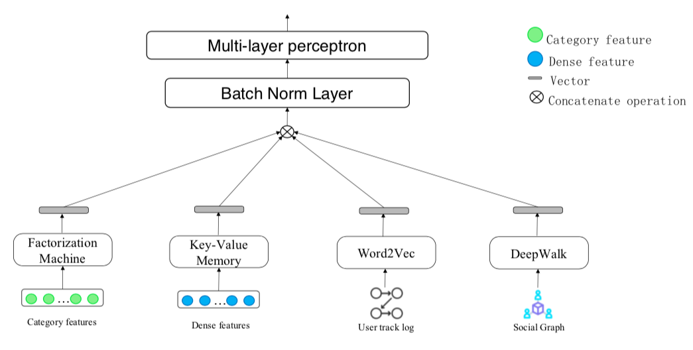

# 腾讯广告赛2019 top1方案解读

> 观后感：大佬的特征工程做的很好，基本流程：单值特征的、交叉特征->单值hash；多值特征->多值hash(加权)->结合交叉特征进行特征交叉；构造序列->w2v,deepwalk->稠密向量直接输入模型；kv特征（暂时不了解选择标准与选择理由)->key-value memory network->输入模型；综合上面的特征使用batch norm结合mlp得到logit，任务为回归任务，损失函数使用MAE，优化器有几种选择，adam等

## 模型框架


## 特征工程
首先对日志文件做了处理，将timestamp格式的时间转化为天、小时、分钟；统计测试集与验证集的曝光数与平均竞标价格。
```

	####################################################################################
	
	# 单值特征，直接embedding:支持任何可以转换成字符串的数据类型，比如浮点数，会转换成字符串
	single_features = ['periods_cont', 'aid', 'gender', 'crowd_direction', 'delivery_periods', 'advertiser', 'good_id',
	                   'good_type', 'ad_type_id', 'consuptionAbility', 'os', 'work', 'connectionType', 'ad_size',
	                   'good_id_advertiser_count', 'good_id_aid_count', 'good_id_ad_size_count', 'good_id_ad_type_id_count',
	                   'good_id_good_id_size', 'advertiser_good_id_count', 'advertiser_aid_count',
	                   'advertiser_ad_size_count', 'advertiser_ad_type_id_count', 'advertiser_good_type_count',
	                   'advertiser_advertiser_size', ]
	
	# 交叉特征，会使用分解机提取特征:支持任何可以转换成字符串的数据类型。比如浮点数，会转换成字符串
	cross_features = ['aid', 'gender', 'crowd_direction', 'delivery_periods', 'advertiser', 'good_id', 'good_type',
	                  'ad_type_id', 'consuptionAbility', 'os', 'work', 'connectionType', 'ad_size']
	
	# 多值特征，会使用分解机提取特征:支持字符串数据类型，用空格隔开
	multi_features = ['aid_uids', 'age', 'area', 'status', 'behavior', 'good_id_advertisers', 'good_id_request_days',
	                  'good_id_positions', 'good_id_period_ids', 'good_id_wdays', 'advertiser_good_ids',
	                  'advertiser_request_days', 'advertiser_positions', 'advertiser_period_ids', 'advertiser_wdays']
	
	# 稠密特征，直接放入MLP中:主要用于embedding特征，转化率等
	dense_features = ['uid_w2v_embedding_aid_64_' + str(i) for i in range(64)] + ['uid_w2v_embedding_good_id_64_' + str(i)
	                                                                              for i in range(64)] + [
	                     'uid_w2v_embedding_advertiser_64_' + str(i) for i in range(64)]
	dense_features += ['uid_aid_aid_deepwalk_embedding_64_' + str(i) for i in range(64)] + [
	    'uid_good_id_good_id_deepwalk_embedding_64_' + str(i) for i in range(64)]
	dense_features += ['periods_on_' + str(i) for i in range(48)]
	
	# key-values 特征，将稠密特征转换成向量: 浮点数类型，且数值在[0,1]之间
	kv_features = ['history_aid_imp', 'history_aid_bid', 'history_aid_pctr', 'history_aid_quality_ecpm',
	               'history_aid_totalEcpm', 'good_id_advertiser_count', 'good_id_aid_count', 'good_id_ad_size_count',
	               'good_id_ad_type_id_count', 'good_id_good_id_size', 'advertiser_good_id_count', 'advertiser_aid_count',
	               'advertiser_ad_size_count', 'advertiser_ad_type_id_count', 'advertiser_good_type_count',
	               'advertiser_advertiser_size', 'good_id_imp_median', 'good_id_imp_std', 'good_id_imp_min',
	               'good_id_imp_max', 'advertiser_imp_mean', 'advertiser_imp_median', 'advertiser_imp_std',
	               'advertiser_imp_min', 'advertiser_imp_max', 'create_timestamp']
```
### 单值特征&交叉特征
主要是一些基本特征与统计特征，在输入到模型的时候会转化为字符串并hash化获得embedding
引入embedding参数
```

    #单值特征，直接embedding
    if hparams.single_features is not None:
        self.single_features=tf.placeholder(shape=(None,len(hparams.single_features)), dtype=tf.int32)
        self.single_emb_v2=tf.get_variable(shape=[hparams.single_hash_num,hparams.single_k],
                                           initializer=self.initializer,name='emb_v2_single') 
        dnn_input.append(tf.reshape(tf.gather(self.single_emb_v2, self.single_features),[-1,len(hparams.single_features)*hparams.single_k]))
```

训练过程中使用`utils.hash_single_batch()`活动onehot向量，与embedding做矩阵乘法获得embedding，单值特征与交叉特征是做一样的处理，唯一不同的是交叉特征会与多值特征做一次特征交叉

```

    if hparams.single_features is not None:
        single_batch = train_single_features[
                       idx * hparams.batch_size:min((idx + 1) * hparams.batch_size, len(train))]
        single_batch = utils.hash_single_batch(single_batch, hparams)
        feed_dic[self.single_features] = single_batch

    if hparams.cross_features is not None:
        cross_batch = train_cross_features[
                      idx * hparams.batch_size:min((idx + 1) * hparams.batch_size, len(train))]
        cross_batch = utils.hash_single_batch(cross_batch, hparams)
        feed_dic[self.cross_features] = cross_batch
```

`utils.hash_single_batch()`

```

	def hash_single_batch(batch,hparams):
	    for b in batch:
	        for i in range(len(b)):
	            b[i]=abs(hash('key_'+str(i)+' value_'+str(b[i]))) % hparams.single_hash_num
	    return batch
```

### 多值特征
多值特征提取
```

	def crowd_uid(train_df, test_df, f1, f2, log, k):
	    # 多值特征，提取以f1为主键，f2在log中出现Topk的ID
	    # 如f1=aid,f2=uid，k=100,则表示访问该广告最多的前100名用户
	    print("crowd_uid features", f1, f2)
	    dic = {}
	    log[f1] = log[f1].fillna(-1).astype(int)
	    train_df[f1] = train_df[f1].fillna(-1).astype(int)
	    test_df[f1] = test_df[f1].fillna(-1).astype(int)
	    for item in tqdm(log[[f1, f2, 'request_day']].values, total=len(log)):
	        try:
	            dic[item[0]][0][item[1]] += 1
	        except:
	            dic[item[0]] = [Counter(), Counter()]
	            dic[item[0]][0][item[1]] = 1
	
	    items = []
	    for key in tqdm(dic, total=len(dic)):
	        conter = dic[key][0]
	        item = [str(x[0]) for x in conter.most_common(k)]
	        if len(item) == 0:
	            item = ['-1']
	        items.append([key, ' '.join(item)])
	
	    df = pd.DataFrame(items)
	    df.columns = [f1, f1 + '_' + f2 + 's']
	    df = df.drop_duplicates(f1)
	    try:
	        del train_df[f1 + '_' + f2 + 's']
	        del test_df[f1 + '_' + f2 + 's']
	    except:
	        pass
	    train_df = train_df.merge(df, on=f1, how='left')
	    test_df = test_df.merge(df, on=f1, how='left')
	    train_df[f1 + '_' + f2 + 's'] = train_df[f1 + '_' + f2 + 's'].fillna('-1')
	    test_df[f1 + '_' + f2 + 's'] = test_df[f1 + '_' + f2 + 's'].fillna('-1')
	    del df
	    del items
	    del dic
	    gc.collect()
	    return train_df, test_df
```
与单值hash不同，多值特征的hash是带权值的
```

	def hash_multi_batch(batch,hparams):
	    lengths=0
	    for b in batch:
	        for i in range(len(b)):
	            b[i]=[abs(hash('key_'+str(i)+' value_'+str(x)))% hparams.multi_hash_num for x in str(b[i]).split()] 
	            lengths=max(lengths,len(b[i]))
	            if len(b[i])==0:
	                b[i]=[abs(hash('key_'+str(i)+' value_'+str('<pad>')))% hparams.multi_hash_num]
	    batch_t=np.zeros((len(batch),len(hparams.multi_features),min(hparams.max_length,lengths)))
	    weights_t=np.zeros((len(batch),len(hparams.multi_features),min(hparams.max_length,lengths)))
	
	    
	    for i in range(len(batch)):
	        for j in range(len(batch[i])):
	            for k in range(min(hparams.max_length,len(batch[i][j]))):
	                batch_t[i,j,k]=batch[i][j][k]
	                weights_t[i,j,k]=1
	
	
	    return batch_t,weights_t
```

### dense特征
主要是基于自然序列的w2v与基于图的deepwalk生成的稠密向量
```

	def w2v(log, pivot, f, flag, L):
	    # word2vec算法
	    # log为曝光日志，以pivot为主键，f为embedding的对象，flag为dev或test，L是embedding的维度
	    print("w2v:", pivot, f)
	
	    # 构造文档
	    log[f] = log[f].fillna(-1).astype(int)
	    sentence = []
	    dic = {}
	    day = 0
	    log = log.sort_values(by='request_day')
	    log['day'] = log['request_day']
	    for item in log[['day', pivot, f]].values:
	        if day != item[0]:
	            for key in dic:
	                sentence.append(dic[key])
	            dic = {}
	            day = item[0]
	        try:
	            dic[item[1]].append(str(int(item[2])))
	        except:
	            dic[item[1]] = [str(int(item[2]))]
	    for key in dic:
	        sentence.append(dic[key])
	    print(len(sentence))
	    # 训练Word2Vec模型
	    print('training...')
	    random.shuffle(sentence)
	    model = Word2Vec(sentence, size=L, window=10, min_count=1, workers=10, iter=10)
	    print('outputing...')
	    # 保存文件
	    values = set(log[f].values)
	    w2v = []
	    for v in values:
	        try:
	            a = [int(v)]
	            a.extend(model[str(v)])
	            w2v.append(a)
	        except:
	            pass
	    out_df = pd.DataFrame(w2v)
	    names = [f]
	    for i in range(L):
	        names.append(pivot + '_w2v_embedding_' + f + '_' + str(L) + '_' + str(i))
	    out_df.columns = names
	    out_df.to_pickle('data/' + pivot + '_' + f + '_' + flag + '_w2v_' + str(L) + '.pkl')

	def deepwalk(log, f1, f2, flag, L):
	    # Deepwalk算法，
	    print("deepwalk:", f1, f2)
	    # 构建图
	    dic = {}
	    for item in log[[f1, f2]].values:
	        try:
	            str(int(item[1]))
	            str(int(item[0]))
	        except:
	            continue
	        try:
	            dic['item_' + str(int(item[1]))].add('user_' + str(int(item[0])))
	        except:
	            dic['item_' + str(int(item[1]))] = set(['user_' + str(int(item[0]))])
	        try:
	            dic['user_' + str(int(item[0]))].add('item_' + str(int(item[1])))
	        except:
	            dic['user_' + str(int(item[0]))] = set(['item_' + str(int(item[1]))])
	    dic_cont = {}
	    for key in dic:
	        dic[key] = list(dic[key])
	        dic_cont[key] = len(dic[key])
	    print("creating")
	    # 构建路径
	    path_length = 10
	    sentences = []
	    length = []
	    for key in dic:
	        sentence = [key]
	        while len(sentence) != path_length:
	            key = dic[sentence[-1]][random.randint(0, dic_cont[sentence[-1]] - 1)]
	            if len(sentence) >= 2 and key == sentence[-2]:
	                break
	            else:
	                sentence.append(key)
	        sentences.append(sentence)
	        length.append(len(sentence))
	        if len(sentences) % 100000 == 0:
	            print(len(sentences))
	    print(np.mean(length))
	    print(len(sentences))
	    # 训练Deepwalk模型
	    print('training...')
	    random.shuffle(sentences)
	    model = Word2Vec(sentences, size=L, window=4, min_count=1, sg=1, workers=10, iter=20)
	    print('outputing...')
	    # 输出
	    values = set(log[f1].values)
	    w2v = []
	    for v in values:
	        try:
	            a = [int(v)]
	            a.extend(model['user_' + str(int(v))])
	            w2v.append(a)
	        except:
	            pass
	    out_df = pd.DataFrame(w2v)
	    names = [f1]
	    for i in range(L):
	        names.append(f1 + '_' + f2 + '_' + names[0] + '_deepwalk_embedding_' + str(L) + '_' + str(i))
	    out_df.columns = names
	    print(out_df.head())
	    out_df.to_pickle('data/' + f1 + '_' + f2 + '_' + f1 + '_' + flag + '_deepwalk_' + str(L) + '.pkl')
	    ########################
	    values = set(log[f2].values)
	    w2v = []
	    for v in values:
	        try:
	            a = [int(v)]
	            a.extend(model['item_' + str(int(v))])
	            w2v.append(a)
	        except:
	            pass
	    out_df = pd.DataFrame(w2v)
	    names = [f2]
	    for i in range(L):
	        names.append(f1 + '_' + f2 + '_' + names[0] + '_deepwalk_embedding_' + str(L) + '_' + str(i))
	    out_df.columns = names
	    print(out_df.head())
	    out_df.to_pickle('data/' + f1 + '_' + f2 + '_' + f2 + '_' + flag + '_deepwalk_' + str(L) + '.pkl')
```


### 特征交叉

参考[xdeepfm解读](https://github.com/chengjian2018/data-science-competition/blob/main/other-contest/Tencent2019/recommend_systems.md)，代码部分为
```

    def _build_extreme_FM(self, hparams, nn_input, res=False, direct=False, bias=False, reduce_D=False, f_dim=2):
        hidden_nn_layers = []
        field_nums = []
        final_len = 0
        field_num = hparams.feature_nums
        nn_input = tf.reshape(nn_input, shape=[-1, int(field_num), hparams.k])
        field_nums.append(int(field_num))
        hidden_nn_layers.append(nn_input)
        final_result = []
        split_tensor0 = tf.split(hidden_nn_layers[0], hparams.k * [1], 2)
        with tf.variable_scope("exfm_part", initializer=self.initializer) as scope:
            for idx, layer_size in enumerate(hparams.cross_layer_sizes):
                split_tensor = tf.split(hidden_nn_layers[-1], hparams.k * [1], 2)
                dot_result_m = tf.matmul(split_tensor0, split_tensor, transpose_b=True)
                dot_result_o = tf.reshape(dot_result_m, shape=[hparams.k, -1, field_nums[0]*field_nums[-1]])
                dot_result = tf.transpose(dot_result_o, perm=[1, 0, 2])

                if reduce_D:
                    filters0 = tf.get_variable("f0_" + str(idx),
                                               shape=[1, layer_size, field_nums[0], f_dim],
                                               dtype=tf.float32)
                    filters_ = tf.get_variable("f__" + str(idx),
                                               shape=[1, layer_size, f_dim, field_nums[-1]],
                                               dtype=tf.float32)
                    filters_m = tf.matmul(filters0, filters_)
                    filters_o = tf.reshape(filters_m, shape=[1, layer_size, field_nums[0] * field_nums[-1]])
                    filters = tf.transpose(filters_o, perm=[0, 2, 1])
                else:
                    filters = tf.get_variable(name="f_"+str(idx),
                                         shape=[1, field_nums[-1]*field_nums[0], layer_size],
                                         dtype=tf.float32)
                # dot_result = tf.transpose(dot_result, perm=[0, 2, 1])
                curr_out = tf.nn.conv1d(dot_result, filters=filters, stride=1, padding='VALID')
                
                # BIAS ADD
                if bias:
                    b = tf.get_variable(name="f_b" + str(idx),
                                    shape=[layer_size],
                                    dtype=tf.float32,
                                    initializer=tf.zeros_initializer())
                    curr_out = tf.nn.bias_add(curr_out, b)

                curr_out = self._activate(curr_out, hparams.cross_activation)
                
                curr_out = tf.transpose(curr_out, perm=[0, 2, 1])
                
                if direct:

                    direct_connect = curr_out
                    next_hidden = curr_out
                    final_len += layer_size
                    field_nums.append(int(layer_size))

                else:
                    if idx != len(hparams.cross_layer_sizes) - 1:
                        next_hidden, direct_connect = tf.split(curr_out, 2 * [int(layer_size / 2)], 1)
                        final_len += int(layer_size / 2)
                    else:
                        direct_connect = curr_out
                        next_hidden = 0
                        final_len += layer_size
                    field_nums.append(int(layer_size / 2))

                final_result.append(direct_connect)
                hidden_nn_layers.append(next_hidden)


            result = tf.concat(final_result, axis=1)
            
            result = tf.reduce_sum(result, -1)

            return result
```

### key-values memory network

目前还没呀搞懂这个模块的作用，网上的解读也不够深入
代码部分为：
```

    #key-values memory
    if hparams.kv_features is not None:
        index=[i/hparams.kv_batch_num for i in range(hparams.kv_batch_num+1)]    
        index=tf.constant(index)
        distance=1/(tf.abs(self.kv_features[:,:,None]-index[None,None,:])+0.00001)
        weights=tf.nn.softmax(distance,-1) #[batch_size,kv_features_size,kv_batch_num]
        kv_emb=tf.reduce_sum(weights[:,:,:,None]*kv_emb_v2[None,:,:,:],-2)
        kv_emb=tf.reshape(kv_emb,[-1,len(hparams.kv_features)*hparams.k])
        dnn_input.append(kv_emb)
```
## 模型构造
先batch_norm,在进行MLP类似的过程
```

    #MLP
    dnn_input=tf.concat(dnn_input,1)
    if hparams.norm is True:
        dnn_input=self.batch_norm_layer(dnn_input,self.use_norm,'dense_norm')        

    input_size=int(dnn_input.shape[-1])
    for idx in range(len(hparams.hidden_size)):
        dnn_input=tf.cond(self.use_norm, lambda: tf.nn.dropout(dnn_input,1-hparams.dropout), lambda: dnn_input)
        glorot = np.sqrt(2.0 / (input_size + hparams.hidden_size[idx]))
        W = tf.Variable(np.random.normal(loc=0, scale=glorot, size=(input_size, hparams.hidden_size[idx])), dtype=np.float32)
        dnn_input=tf.tensordot(dnn_input,W,[[-1],[0]])
        dnn_input=tf.nn.relu(dnn_input)
        input_size=hparams.hidden_size[idx]

    glorot = np.sqrt(2.0 / (hparams.hidden_size[-1] + 1))
    W = tf.Variable(np.random.normal(loc=0, scale=glorot, size=(hparams.hidden_size[-1], 1)), dtype=np.float32)     
    logit=tf.tensordot(dnn_input,W,[[-1],[0]])
    self.val=logit[:,0]

    self.score=tf.abs(self.val-self.label)
    self.loss=tf.reduce_mean(self.score)
```
