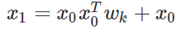

# 推荐系统解读
> 包括wide&deep、DCN、deepFM、xDeepFM

## Wide&Deep

### 论文背景

- "Wide" 类型的模型利用cross-procuct方式进行特征交叉产生的特征具有很好的效果和很好的可解释性，但是需要较强的经验知识进行特征工程。
- "deep"类型的模型通过将稀疏特征转换为稠密特征从而进一步挖掘高阶的特征组合，这种方式在用户-商品对比比较稀疏的情况下，具备较强的泛化能力，可能给用户推荐不太相关的商品。
- 为了进一步结合两者的优势，文章提出了一种全新的deep&wide的网络结构

### Wide&Deep模型

#### wide部分
wide部分主要就是一个广义线性模型（如LR），具体模型如下：

这里值得注意的是，这部分的输入特征包括两部分，一部分是原始的输入特征，另一部分是交叉特征，其中一种方式就是cross-product，具体定义如下：

简单理解cross-product就是在二值特征的情况下对其进行与操作，这种特征交叉的方式给广义线性模型增加的非线性的表述，从而进一步提高了模型的泛化性能。

#### deep部分
Deep部分简单理解就是Embedding+MLP这种非常普遍的结构，随着近几年深度学习在推荐系统中的大规模应用，Embedding+MLP这种网络结构基本成为了标配，具体模型结构如下所示：

从上图的网络结构可以看出，中间隐藏层的激活函数都是ReLu，最后一层的激活函数是sigmoid

#### 联合训练
整体网络结构

## DCN(Deep & Cross Network for Ad Click Predictions)

> 整体结构

### embedding and stacking layer
DCN底层的两个功能是Embed和Stack。

#### embed
在web-scale的推荐系统比如CTR预估中，输入的大部分特征都是类别型特征，通常的处理办法就是编码为one-hot向量，对于实际应用中维度会非常高且稀疏，因此使用：

来将这些离散特征转换成实数值的稠密向量。
#### stack
处理完了类别型特征，还有连续型特征需要处理。所以我们把连续型特征规范化之后，和嵌入向量stacking（堆叠）到一起形成一个向量，就得到了原始的输入：

### Cross network
Cross Network是这个模型的核心，它被设计来高效地应用显式的交叉特征，关键在于如何高效地进行feature crossing。对于每层的计算，使用下述公式：

其中 `x_l` 和 `x_l+1` 分别是第l层和第l+1层cross layer的输出（的列向量）， `w_l` 和 `b_l` 是这两层之间的连接参数。注意上式中所有的变量均是列向量，W也是列向量，并不是矩阵。

这其实应用了残差网络的思想，每一层的输出，都是上一层的输出加上feature crossing f。而f就是在拟合该层输出和上一层输出的残差 `x_l+1 - x_l` 。残差网络有很多优点，其中一点是处理梯度退化/消失的问题，使网络层数可以“更深”。一层交叉层的可视化如下图所示：

Cross Network特殊的网络结构使得cross feature的阶数随着layer depth的增加而增加。相对于输入 `x_0` 来说，一个l层的cross network的cross feature的阶数为l+1。
假设一共有 `L_c` 层cross layer，起始输入 `x_0` 的维度为d。那么整个cross network的参数个数为: `d * L_c * 2`。
因为每一层的W和b都是d维的。从上式可以发现，复杂度是输入维度d的线性函数，所以相比于deep network，cross network引入的复杂度微不足道。这样就保证了DCN的复杂度和DNN是一个级别的。论文中分析Cross Network的这种效率是因为 `x_0 * x_T` 的秩为1，使得我们不用计算并存储整个的矩阵就可以得到所有的cross terms。

但是，正是因为cross network的参数比较少导致它的表达能力受限，为了能够学习高阶非线性的组合特征，DCN并行的引入了Deep Network。

### deep network
深度网络就是一个全连接的前馈神经网络，每个深度层具有如下公式: `h_l+1 = f(w_l * h_l + b_l)`

分析计算一下参数的数量来估计下复杂度。假设输入 `x_0` 维度为d，一共有 `L_c` 层神经网络，每一层的神经元个数都是m个。那么总的参数或者复杂度为：`d*m + m + (m*m + m)*(L_d - 1)`

### combination layer
Combination Layer把Cross Network和Deep Network的输出拼接起来，然后经过一个加权求和后得到logits，然后输入到标准的逻辑回归函数得到最终的预测概率。形式化如下：

p是最终的预测概率； `X_L1` 是d维的，表示Cross Network的最终输出； `h_L2` 是m维的，表示Deep Network的最终输出； `W_logits` 是Combination Layer的权重；最后经过sigmoid函数，得到最终预测概率。
损失函数使用带正则项的log loss，形式化如下：

此外，Cross Network和Deep Network，DCN是一起训练Cross Network和Deep Network的，这样网络可以知道另外一个网络的存在。

## deepFM
- DeepFM模型包含FM和DNN两部分，FM模型可以抽取low-order特征，DNN可以抽取high-order特征。无需Wide&Deep模型人工特征工程。
- 由于输入仅为原始特征，而且FM和DNN共享输入向量特征，DeepFM模型训练速度很快。
- 在Benchmark数据集和商业数据集上，DeepFM效果超过目前所有模型。

### DeepFM模型

为了同时利用low-order和high-order特征，DeepFM包含FM和DNN两部分，两部分共享输入特征。对于特征i，标量wi是其1阶特征的权重，该特征和其他特征的交互影响用隐向量Vi来表示。Vi输入到FM模型获得特征的2阶表示，输入到DNN模型得到high-order高阶特征。模型联合训练，结果可表示为：

#### FM部分

FM模型不单可以建模1阶特征，还可以通过隐向量点积的方法高效的获得2阶特征表示，即使交叉特征在数据集中非常稀疏甚至是从来没出现过。这也是FM的优势所在。

#### Deep部分
同上面的模型

## XDeepFM
### 背景
此篇论文其实是针对DCN进行改进的，DCN的cross层接在embedding层之后，虽然可以显式的自动构造高阶特征，但特征交互发生在元素级而非向量级。这里先简单介绍下bit-wise与vector-wise；显式特征交互和隐式特征交互两组概念：
> 假设隐向量的维度为3维，如果两个特征(对应的向量分别为(a1,b1,c1) 和(a2,b2,c2) 的话，在进行交互时，交互的形式类似于f(w1∗a1∗a2,w2∗b1∗b2,w3∗c1∗c2)的话，此时我们认为特征交互是发生在元素级（bit-wise）上；如果特征交互形式类似于f(w∗(a1∗a2,b1∗b2,c1∗c2))的话，那么我们认为特征交互是发生在特征向量级（vector-wise）。

> 显式的特征交互和隐式的特征交互：以两个特征为例xi和xj，在经过一系列变换后，我们可以表示成 wij∗(xi∗xj) 的形式，就可以认为是显式特征交互，否则的话，是隐式的特征交互。

例如，Age Field对应嵌入向量<a1,b1,c1>，Occupation Field对应嵌入向量<a2,b2,c2>，在Cross层，a1,b1,c1,a2,b2,c2会拼接后直接作为输入，即它意识不到Field vector的概念。Cross 以嵌入向量中的单个bit为最细粒度（这违背了因子分解机的初衷），而FM是以向量为最细粒度学习相关性，即vector-wise。xDeepFM的动机，正是将FM的vector-wise的思想引入Cross部分。接下来我们来看细节。
### DCN的不足
xDeepFM主要是针对DCN的改进，论文中指出了DCN的缺点（为何我们前面说DCN的特征交叉是元素级别的呢，下面给出说明），提出了更有效的解决办法，作者称之为CIN结构。
DCN的网络结构：

- 首先将数据进行embedding和stacking，输入到Cross网络和Deep网络中；然后将两个网络的输出融合得到输出。
- DCN中对Cross网络的设置有如下公式：
- 
- 简化这个公式，去掉偏置项，可以得到：
- 
- 对于x1，有如下公式：
- 
- 合并可得到：
- 
- 其中 `α_1`是一个标量，不断递推到 `x_i+1` .... 有：
- 

实际上， `α_i+1` 仍是一个标量，就相当于让 `x_0` 不断乘上一个数。

这一步我们就可以明显地看出了：DCN的特征交互是发生在元素级（bit-wise）而不是特征向量之间（vector-wise），这一点违背了因子分解机的初衷。

### CIN(Copressed Inreraction Network)

### 为什么是CIN

### 复杂度分析

