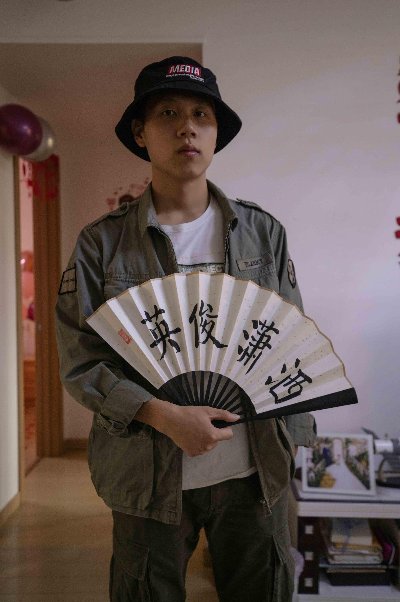
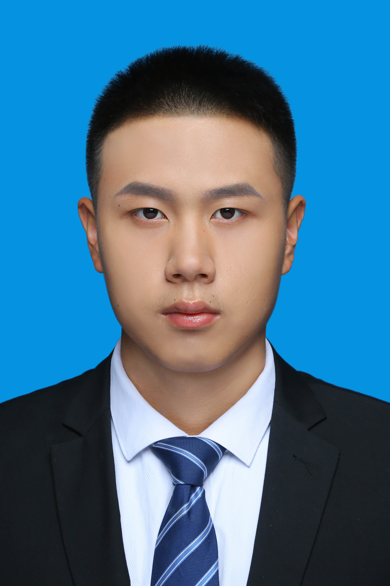

# 自我介绍
> 小姐姐你好，在大工脱单上看到你的帖子，着实惊艳到我了，确实心动了，第一次发联系贴，写得不好见谅哈~
> 
> 自我介绍分以下几个部分：
> 异同部分为自身情况与小姐姐期望的对比；介绍部分为个人详细自我介绍；附件则为个人照与生活照

## 异同部分
因为不知道小姐姐写的要求是否是硬性要求，我就把自身情况与小姐姐的要求做对比。
### 相同点
- 喜欢摄影：目前拥有一台佳能6d2全画幅相机以及小痰盂、腾龙28-75两枚镜头（目前闲置在家），喜欢拍摄建筑，人像在学
- 喜欢健身、游泳：有救生员证，会潜水，会蛙泳、自由泳，目前在学蝶泳，感兴趣可以一起学游泳
- 研三在读，作息规律，之前都是三点一线，没有时间谈对象

### 不同点
- 身高175，可能略低于要求
- 不会舞蹈与唱歌，只会听歌hhh
- 目前已经签约北京一家互联网大厂，近几年会在北京工作，之后定居地点可以协商（比较独立，主要听对象的，不会被父母胁迫）

## 介绍
### 兴趣爱好
- 摄影、健身、游泳、飞盘
- 各种剧、电影：喜欢看科幻悬疑题材的剧与电影，包括但不限于其他题材优秀作品，目前已经刷了豆瓣top250的影单
- steam游戏：非3A大作，主要是一些娱乐向的小游戏，包括但不限于pummel party；糖豆人；双人成行
- 狼人杀：拥有一套完整的数据库，喜欢抿身份

### 理想的她
对标小姐姐，能够一起分享生活的点滴，一起尝试新鲜事物，在忙碌的时候互相鼓励。

### 自我介绍
我是大工经管学院的一名研三在读学生，目前已经签约了北京一家互联网大厂，职位是算法策略，第一年薪资税前40+w，由于之前一直忙着准备工作，在经管这个女生偏多的专业仍未脱单。圈子十分干净，生活习惯规律，无不良嗜好，个人比较独立，但会听对象的。想找一个可以宠的对象，守护她，给她快乐。

## 附件

> 生活照

> 正装照

### 联系方式
微信：`Mr_Noone_Cnc`
